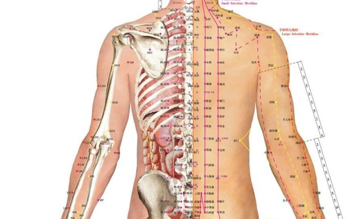

 more 

【題解】背腧，系指五臟所主的背部腧穴。因文中主要記述了五臟所主背部腧穴的位置和取穴方法，故稱為「背腧」。

【原文】
黃帝問于岐伯曰：願聞五臟之腧，出於背者。
岐伯曰：胸中大腧，在杼骨之端，肺腧在三焦[1]之間，心腧在五焦之間，膈腧在七焦之間，肝腧在九焦之間，脾腧在十一焦之間，腎腧在十四焦之間。皆挾脊相去[2]三寸所，則欲得而驗之，按其處，應在中而痛解，乃其腧也。灸之則可，刺之則不可。氣盛則瀉之，虛則補之。以火補者，毋吹其火，須自滅也；以火瀉之，疾吹其火，傳其艾，須其火滅也。

【提要】
在論述五臟背腧穴的位置和取穴方法的基礎上，指出治療時應運用灸法而不宜深刺的道理，並要根據病證的虛與實分別採用補法和瀉法。

【注釋】
[1]三焦：本文特指第三脊椎。餘此類推。
[2]相去：本文指平行兩個同名穴位之間的距離。

【詳解】
黃帝問：岐伯道我想瞭解五臟的俞穴，都出於背部的什麼位置。
岐伯說：胸中的大杼穴在項後第一椎骨下的兩側，肺俞在第三椎下的兩側，心俞在第五椎下的兩側，膈俞在第七椎下的兩側，肝俞在第九椎下的兩側，脾俞在十一椎的兩側，腎俞在十四椎的兩側。這些俞穴都在脊椎的兩旁，左右穴位相距三寸，距離背正中線約一寸五分。確定這些俞穴的位置，檢驗的方法是，用手指按在穴位上，病人感到局部酸麻脹痛，體內的病痛得到緩解，便是取中了俞穴。

對於背俞穴，治療上應當採用灸法，不能採用針刺方法。在運用灸法時，邪氣盛則施以瀉法，正氣虛則施以補法。在運用灸法來補益正氣時，艾火燃著後不要吹滅，要等待火自然熄滅。用灸法瀉除邪氣時，艾火燃著後要迅速將它吹旺，然後用手搏撚艾炷，一定要把艾火熄滅。

大杼穴

胸中大腧，在杼骨之端，

胸中的大杼穴在項後第一椎骨下的兩側，

肺俞

肺腧在三焦[1]之間，

肺俞在第三椎下的兩側，

心俞

心腧在五焦之間，

心俞在第五椎下的兩側，

膈俞

膈腧在七焦之間，

膈俞在第七椎下的兩側，

肝俞

肝腧在九焦之間，

肝俞在第九椎下的兩側，

脾俞

脾腧在十一焦之間，

脾俞在十一椎的兩側，

腎俞

腎腧在十四焦之間。

腎俞在十四椎的兩側。

【按語】
本文所述位於背脊兩側的大杼、膈俞以及五臟的俞穴，一直為針灸醫家所採用。文中對於五臟俞穴特別指出「灸之則可，刺之則不可」，這主要說明背部不可深刺，深刺會刺傷內臟，發生危險，但並不是說背部絕對禁刺。對針灸兩法而言，一般認為補用灸，瀉用針，本文則指出灸法中也有補瀉之別。本文「按其處，應在中而痛解」，是後世「以痛為腧」的先導，這不僅用於針刺治療的取穴，也發展為對某些疾病的診斷方法，稱之為「穴位壓痛辨病診斷法」。(張辰奕整理)

