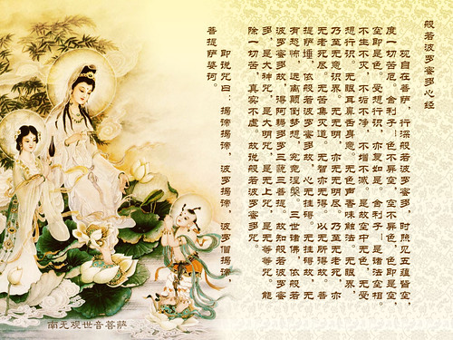

 more 

【題解】
主要論述了不同體質的人，對於針刺、艾灸和藥物的耐受力也不同，治療疾病，要根據不同的體質，因人制宜。因本篇主要是闡述人體對針刺灸火的耐痛問題，所以名為「論痛」。

【原文】
黃帝問于少俞曰：筋骨之強弱，肌肉之堅脆，皮膚之厚薄，腠理之疏密，各不同，其于針石火炳之痛何如?腸胃之厚薄堅脆亦不等，其于毒藥何如願盡聞之。
少俞曰：人之骨強、筋弱、肉緩、皮膚厚者，耐痛，其于針石之痛火炳亦然。

黃帝曰：其耐火炳者，何以知之?
少俞答：曰：加以黑色而美骨叫者，耐火炳。

黃帝曰：其不耐針石之痛者，何以知之?
少俞曰：堅肉薄皮者，不耐針石之痛，於火炳亦然。

黃帝曰：人之病，或同時而傷，或易已，或難已，其故何如?
少俞曰：同時而傷，其身多熱者，易已多寒者，難已。

黃帝曰：人之勝毒，何以知之?
少俞曰：胃厚、色黑、大骨及肥骨者，皆勝毒；故其瘦而薄胃者，皆不勝毒也。

【提要】
主要闡述了人體肌肉、筋骨、皮膚、腠理和腸胃的堅實與脆弱、厚與薄、粗疏與緻密等不同，對於針刺、艾灸、藥物的耐受力也不同，指出治療疾病要因人制宜，施用個性化的治療方法。

【注釋】
[1]美骨：骨骼發育完善、健美。

【詳解】
黃帝問少俞道：人體的筋骨有強壯與軟弱的不同，肌肉有堅實與脆弱的區分，皮膚有厚薄之別，腠理有粗疏與緻密之異，他們對於針刺和艾火灸灼所引起疼痛的忍耐能力如何呢，人體腸胃厚薄、堅實和脆弱也不相同，他們對於藥物的耐受能力又怎樣呢?希望你詳盡地講給我聽聽。
少俞回答說：骨骼強壯、筋脈軟弱、肌肉舒緩、皮膚較厚的人，能夠忍耐疼痛，無論是對針刺或艾火燒灼的疼痛，其耐受程度都是同樣的。

黃帝問：怎麼知道有些人能夠耐受艾火燒灼的疼痛呢?
少俞答：道：不但骨骼強壯、筋脈軟弱、肌肉舒緩、皮膚較厚，還有色黑、骨骼發育完善而勻稱，就能夠耐受艾火燒灼的疼痛。

黃帝道怎麼知道有些人不能耐受針刺的疼痛呢?
少俞說：肌肉堅實、皮膚薄的人，不能耐受針刺的疼痛。

黃帝問：在同一時間內患同樣的病變，有的人容易治癒，有的不容易治癒，這是什麼原因呢?
少俞答：道：同時患同樣的疾病，如果以熱證為主的，就容易治癒，以寒證為主的就難以治癒。

黃帝問：如何瞭解人體對藥物的耐受力呢?
少俞說：胃厚實、色黑、骨骼粗壯、身體肥胖的人，都對藥物有較強的耐受力。身體消瘦、胃薄弱者，對藥物的耐受力就差。

【按語】
本文討論了人體的素質不同，在治療上有能否耐受針石、火熵之痛和耐受毒藥的區別，提出了因人制宜的重要觀點，是中醫學辨證論治的基礎。文中還提出疾病痊癒的難易，與病證屬性的寒熱有密切的關係，從邪氣角度考慮病程的進展，是十分有意義的。(張辰奕整理)

