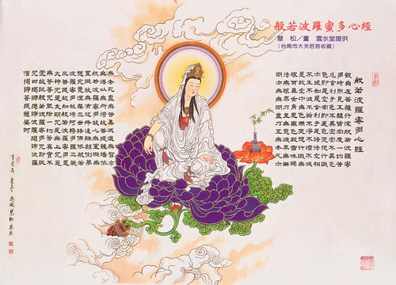

 more 
逆順第五十五(詳解)

【題解】
逆順，系指反常與正常，既指氣行的逆順，又含針刺的逆與順。因文中主要論述了人體出現氣血逆亂後，針刺方法運用的逆與順，故稱為「逆順」。

【原文】
黃帝問于伯高曰：余聞氣有逆順，脈有盛衰，刺有大約[1]可得聞乎?
伯高曰：氣之逆順者，所以應天地陰陽四時五行也脈之盛衰者，所以候血氣之虛實有餘不足；刺之大約者，必明知病之可刺，與其未可刺，與其已不可刺也。

黃帝曰：候之奈何?
伯高曰：兵法日無迎逢逢之氣，無擊堂堂之陣。刺法曰無刺煸煸[2]之熱，無刺漉漉之汗，無刺渾渾之脈，無刺病與脈相逆者。

黃帝曰：候其可刺奈何?
伯高曰：，刺其未生者也其次，刺其未盛者也；其次，刺其已衰者也。刺其方襲者也；與其形之盛者也；與其病之與脈相逆者也。故曰方其盛也，勿敢毀傷，刺其已衰，事必大昌。故曰上工治未病，不治已病，此之謂也。

【提要】
主要闡述了人體氣血發生逆亂時的三種針刺原則，並且說明了不能運用刺法的具體表現，以及運用刺法的時機。揭示了早期診斷、早期治療的精神。

【注釋】
[1]大約：主要的法則。
[2]熵熵熵：口奮，音賀，熵熵，義為高熱熾盛。

【詳解】
黃帝問：我聽說氣有逆有順，脈有盛有衰，針刺方法有總的原則，能講給我聽聽嗎?
伯高答道：氣行的逆順與自然界的陰陽變化、四季的五行規律相對應。脈象的盛衰表現，可以診察氣血的虛實變化。針刺方法總的運用原則，必須明瞭哪些疾病可以運用刺法，哪些不能運用，哪些疾病已經不能通過針刺來救治了。

黃帝問：如何判斷疾病是否適宜運用刺法呢?
伯高回答說：《兵法》上曾經說過，作戰時當敵人攻勢迅猛的時候，不要抵擋其攻擊。對敵人盛大整齊的陣勢，也不能貿然進攻。《刺法》也記載有，熱勢熾盛的不能用刺法，大汗淋漓的不能用刺法，脈象盛大燥疾的急病不能用刺法，脈象和病情相反的也不能用刺法。

黃帝問：怎樣確定哪些疾病適宜運用刺法呢?

伯高回答說：
首先，在沒有發生疾病的時候施用針刺來預防。
其次，在疾病初期，邪氣尚未亢盛的時候，施用刺法。
再次，在邪氣已經衰減而正氣逐漸恢復，因勢利導地施用刺法。
技術低劣的醫生，在邪氣亢盛、或表現的病證很重、或病情與脈象不相符的情況下進行針刺。
所以說，在邪氣亢盛時不要施用刺法而損傷元氣，在邪氣衰減的時候進行針刺，就一定能把疾病治癒。所以，高明的醫生，在沒有發生疾病的時候就進行防治，而不是在疾病發生以後，才進行治療，就是這個意思。(張辰奕整理)

