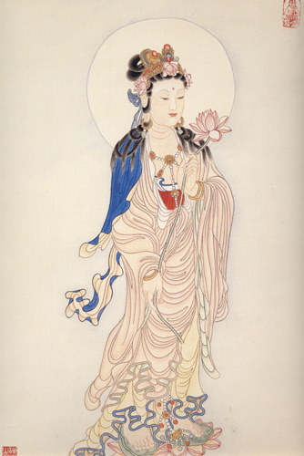

 more 
【題解】
水，水腫。脹，胸腹脹滿。篇中對水腫、膚脹、膨脹、腸覃、石瘕等病證的臨床診斷做了鑒別，並且分別論述了這些病證的病因、病機和治療方法。因文中主要闡述的是以水液運行障礙，導致腹部脹滿、眼瞼和肢體浮腫為主證的水脹病證的診斷與治療，故稱為「水脹」。

【原文】
黃帝問于岐伯曰：水與膚脹、鼓脹、腸覃、石瘕、石水，何以別之?
岐伯答曰：水始起也，目窠上微腫，如新臥起之狀，其頸脈動，時咳，陰股間寒，足脛痘，腹乃大，其水已成矣。以手按其腹，隨手而起，如裹水之狀，此其候也。

黃帝曰：膚脹何以候之?
岐伯曰：膚脹者，寒氣客於皮膚之間，整整[1]然不堅，腹大，身盡腫，皮厚，按其腹，窗[2]而不起，腹色不變，此其候也。

黃帝曰：鼓脹何如?
岐伯曰：腹脹身皆大，大與膚脹等也，色蒼黃，腹筋起，此其候也。

黃帝曰：腸覃何如?
岐伯曰：寒氣客於腸外，與衛氣相搏，氣不得榮，因有所系，癖而內著，惡氣乃起，瘛肉乃生。其始生也，大如雞卵，稍以益大，至其成如懷子之狀，久者離歲，按之則堅，推之則移，月事以時下，此其候也。

黃帝曰：石瘕何如?
岐伯曰：石瘕生於胞中，寒氣客於子門，子門閉塞，氣不得通，惡血當瀉不瀉，蝦以留止，日以益大，狀女[懷子，月事不以時下。皆生於女子，可導而下。

黃帝曰：膚脹鼓脹可刺邪?
岐伯曰：先瀉其脹之血絡，卮調其經，刺去其血絡也。

　
病徵
水腫
水始起也，目窠上微腫，如新臥起之狀，其頸脈動，時咳，陰股間寒，足脛痘，腹乃大，其水已成矣。以手按其腹，隨手而起，如裹水之狀，此其候也。
膚脹
膚脹者，寒氣客於皮膚之間，整整然不堅，腹大，身盡腫，皮厚，按其腹，窗而不起，腹色不變，此其候也。
膨脹
腹脹身皆大，大與膚脹等也，色蒼黃，腹筋起，此其候也。
腸覃
寒氣客於腸外，與衛氣相搏，氣不得榮，因有所系，癖而內著，惡氣乃起，瘛肉乃生。其始生也，大如雞卵，稍以益大，至其成如懷子之狀，久者離歲，按之則堅，推之則移，月事以時下，此其候也。
石瘕
石瘕生於胞中，寒氣客於子門，子門閉塞，氣不得通，惡血當瀉不瀉，蝦以留止，日以益大，狀女[懷子，月事不以時下。皆生於女子，可導而下。

【提要】
本篇對水脹、膚脹、膨脹、腸覃、石瘕等病證倘了鑒別。並且分別論述了這些病證的病因、病機和治療方法。

【注釋】
[1]整：音空，鼓聲。
[2]窗：音咬，深陷。

【詳解】
黃帝問岐伯道：水脹、膚脹、膨脹、腸覃與石水，如何進行鑒別呢?岐伯回答說：水脹發病之初，病人的下眼瞼微腫，好像剛睡醒時的樣子，人迎脈搏動明顯，經常咳嗽，大腿內側寒冷，腳和小腿浮腫，腹部也脹大，出現上述症狀，說明水脹病已經形成。用手按壓病人腹部，放開手時，被按壓的凹陷隨手而起，就好像按在盛水的袋子上一樣，這就是水脹病的特徵。

黃帝問：膚脹病怎樣診斷呢?
岐伯答道：膚脹病是因為寒邪侵入皮膚之間引起的，病人表現腹部脹大，用手叩擊腹部就好像鼓一樣中空而不堅實，全身浮腫，皮膚厚，用手按壓腹部，放開手時凹陷不能隨手而起，腹部皮膚顏色沒有變化，這就是膚脹病的特徵。

黃帝問：膨脹病的表現是什麼樣呢?
岐伯答道：膨脹病的腹部脹大和全身腫脹的表現與膚脹病相同。只是膨脹病的膚色青黃，腹部的青筋暴露，這就是膨脹病的特徵。

黃帝問：腸覃的表現怎樣呢?
岐伯答道：寒邪侵襲腸體外面，與衛氣相互搏結在一起，衛氣不能正常運行，寒邪與衛氣滯留在身體深處，附著於腸外，病邪逐漸增長，便生成了息肉。腸覃病初期，腹部的腫塊像雞蛋那樣大，隨著疾病的發展，腫塊也逐漸增大，完全形成時，腹隆起好像懷孕一樣。病程長的，可以歷經數年。用手按壓，腫塊很堅硬，推之能夠移動。月經仍舊按時來潮。這就是腸覃的特徵。

黃帝問：石瘕的表現又是怎樣的呢?
岐伯答道：石瘕病灶在子宮中，由於寒邪侵犯子宮口，使子宮口閉塞，氣血不能流通，本應按時排泄的惡血不能排泄，以致凝結成塊而滯留在子宮中，隨時間而逐漸增大，腹部隆起也像懷孕一樣，但是月經不能按時來潮。患這種病的都是女性，可以用通導攻下以祛除瘀血的方法治療。

黃帝問：膚脹和膨脹病，可以運用針刺的方法治療嗎?
岐伯答道：治療這兩種疾病，應首先用針刺瀉除脹大的血絡，然後再根據疾病的具體情況調理相應的經脈。但是，無論採取什麼方法治療，都必須首先用針刺祛除血絡中的瘀血。

　
病徵
水腫
水脹發病之初，病人的下眼瞼微腫，好像剛睡醒時的樣子，人迎脈搏動明顯，經常咳嗽，大腿內側寒冷，腳和小腿浮腫，腹部也脹大，出現上述症狀，說明水脹病已經形成。用手按壓病人腹部，放開手時，被按壓的凹陷隨手而起，就好像按在盛水的袋子上一樣，這就是水脹病的特徵。
膚脹
膚脹病是因為寒邪侵入皮膚之間引起的，病人表現腹部脹大，用手叩擊腹部就好像鼓一樣中空而不堅實，全身浮腫，皮膚厚，用手按壓腹部，放開手時凹陷不能隨手而起，腹部皮膚顏色沒有變化，這就是膚脹病的特徵。
膨脹
膨脹病的腹部脹大和全身腫脹的表現與膚脹病相同。只是膨脹病的膚色青黃，腹部的青筋暴露，這就是膨脹病的特徵。
腸覃
寒邪侵襲腸體外面，與衛氣相互搏結在一起，衛氣不能正常運行，寒邪與衛氣滯留在身體深處，附著於腸外，病邪逐漸增長，便生成了息肉。腸覃病初期，腹部的腫塊像雞蛋那樣大，隨著疾病的發展，腫塊也逐漸增大，完全形成時，腹隆起好像懷孕一樣。病程長的，可以歷經數年。用手按壓，腫塊很堅硬，推之能夠移動。月經仍舊按時來潮。這就是腸覃的特徵。
石瘕
石瘕病灶在子宮中，由於寒邪侵犯子宮口，使子宮口閉塞，氣血不能流通，本應按時排泄的惡血不能排泄，以致凝結成塊而滯留在子宮中，隨時間而逐漸增大，腹部隆起也像懷孕一樣，但是月經不能按時來潮。患這種病的都是女性，可以用通導攻下以祛除瘀血的方法治療。

【按語】腸覃和石瘕以月經之有無為鑒別的標誌。對石瘕的治療提出了「可導而下」的原則，

聰明的人，喜歡猜心；雖然每次都猜對了，卻失去了自己的心。 
