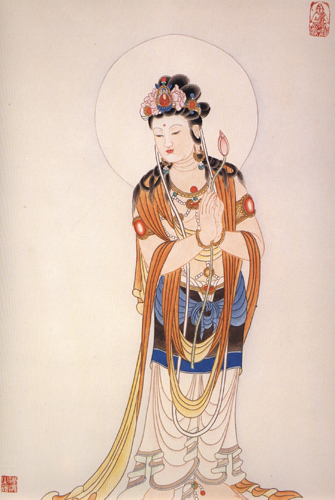

 more 

【題解】
賊風，系指四季氣候異常所形成的邪氣，俗稱外邪。因文中主要討論外邪侵襲人體所發生的疾病，故稱為「賊風」。

【原文】
黃帝曰：夫子言賊風邪氣之傷人也，令人病焉，今有其不離遮罩，不出空穴[1]之中，卒然病者，非不離賊風邪氣，其故何也?
岐伯曰：此皆嘗有所傷，于濕氣藏於血脈之中，分肉之間，久留而不去；若有所墮墜，惡血在內而不去。卒然喜怒不節，飲食不適，寒溫不時，腠理閉而不通。其開而遇風寒，則血氣凝結，與故邪相襲，則為寒痹。其有熱則汗出，汗出則受風，雖不遇賊風邪氣，必有因加而發焉。

【提要】本段主要論述了「因加而發」的發病方式，即因於故邪，加以新邪而發病。

【注釋】
[1]空穴：因上古之人穴居野處，故稱之。

【詳解】
黃帝問：道你經常講到，人體發生疾病都是因為賊風邪氣侵襲人體引起的。但是有些人並沒有離開居處的房屋或遮蔽得很嚴密的地方，沒有遭受賊風邪氣的侵襲，卻突然發生疾病，這是什麼原因呢?
岐伯回答說：
這種情況的形成，都是因為平素就受到邪氣的傷害而沒有察覺所造成的。

或曾經被濕邪傷害，濕邪侵襲人體後，藏伏在血脈和分肉中，長期不能消散；或從高處跌落，使瘀血留滯在體內；或暴喜大怒而情志活動不能節制；或飲食不適當。

或不能根據氣候的寒熱變化而改變自己的生活習慣，導致腠理閉塞而不通暢。若腠理開時感受風寒，使血脈凝滯不通，新感受的風寒與體內原有的邪氣相互搏結，便會形成寒痹。

由上述原因使體內有熱，則會形成身體出汗，在出汗時就容易感受風邪。即便不是遇到賊風邪氣的侵襲，也一定是外邪與體內原有邪氣相互結合，才會使人發生疾病。

【按語】
本文指出卒然發病的原因，除賊風邪氣外，還有其他種種因素，均可引發疾病。這對後世溫病學家「伏氣」觀點的提出，提供了理論依據。

【原文】
黃帝曰：今夫子之所言者，皆病人之所自知也，其毋所遇邪氣，又毋怵惕[1]之所志，卒然而病者，其故何也?唯有因鬼神之事乎?
岐伯曰：此亦有故邪留而未發，因而志有所惡，及有所慕，血氣內亂，兩氣相搏。其所從來者微，視之不見，聽而不聞，故似鬼神。

黃帝曰：其祝而已者，其故何也?
岐伯曰：先巫者，因知百病之勝，先知其病之所從生者，可祝而已也。

【提要】
主要強調雖然有時邪氣侵襲人體不易被察覺，但是疾病的發生絕不是鬼神等因素所導致，並扼要介紹了祝由方法治療疾病的機理。

【注釋】
[1]怵惕：恐懼之義。

【詳解】
黃帝問道：上述疾病發生的原因，都是病人自己能感覺到的。那些既感覺不到有邪氣侵襲，又沒有驚恐等情志的過度刺激，卻突然發病，這是什麼原因呢?是因為有鬼神作祟嗎?
岐伯回答說：
這種情況，也是有宿邪藏伏在體內而尚未發作。
由於性情有所厭惡，思想有所羡慕，而引起氣血逆亂，逆亂的氣血與藏伏在體內的宿邪相互作用便發生疾病。
因為這些疾病發生的原因不明顯，既看不見，又聽不到，所以就好像鬼神作祟一樣。

黃帝問：道這類疾病既然不是鬼神作祟，為什麼用祝由的方法能夠治癒呢?
岐伯回答說：古代的巫醫，掌握一定的治療疾病的方法，又首先瞭解了疾病發生的原因，所以再用祝由方法就能把疾病治癒。

【按語】祝，就是祝由，是古代治療疾病所使用的一種精神療法，《素問‧移精變氣》亦提及，其臨床價值有待於進一步探討。

鄭丹瑞寫的文章，值得分享 :           