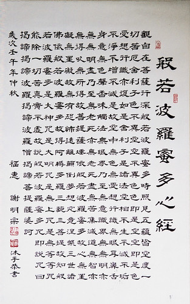

 more 

【題解】
本篇主要論述了五味各有所走，五味偏嗜、太過所出現的病理變化，以及因此引起的各種病證，故篇名「五味」。

【原文】
黃帝問于少俞曰：五味入於口也，各有所走，各有所病。酸走筋，多食之，令人癃；鹹走血，多食之，令人渴辛走氣，多食之，令人洞心；苦走骨，多食之，令人變嘔；甘走肉，多食之，令人悅心。餘知其然也，不知其何由，願聞其故。
少俞答曰：酸入於胃，其氣澀以收，上之兩焦，弗能出入也。不出即留於胃中，胃中和溫，則下注膀胱，膀胱之胞[1]薄以懦，得酸則縮綣，約而不通，水道不行，故癃。陰者，積筋之所終也，故酸入而走筋矣。

黃帝曰：鹹走血，多食之，令人渴，何也?
少俞曰：鹹入於胃，其氣上走中焦，注於脈，則血氣走之，血與鹹相得則凝，凝則胃中汁注之，注之則胃中竭，竭則咽路焦，故舌本千而善渴。血脈者，中焦之道也，故鹹入而走血矣。

黃帝曰：辛走氣，多食之，令人洞心，何也?
少俞曰：辛入於胃，其氣走于上焦，上焦者，受氣而營諸陽者也，薑韭之氣熏之，營衛之氣不時受之，久留心下，故洞心。辛與氣俱行，故辛入而與汗俱出。

黃帝曰：苦走骨，多食之，令人變嘔，何也?
少俞曰：苦入於胃，五穀之氣，皆不能勝苦，苦入下脘，三焦之道皆閉而不通，故變嘔。齒者，骨之所終也，故苦入而走骨，故入而複出，知其走骨也。

黃帝曰：甘走肉，多食之，令人悅心，何也?
少俞曰：甘入於胃，其氣弱小，不能上至於上焦，而與谷留於胃中者，令人柔潤者也，胃柔則緩，緩則蟲動，蟲動則令人挽心。其氣外通於肉，故甘走肉。

五味

五味所走

五味所病

因

酸

酸走筋，

多食之，令人癃；

酸入於胃，其氣澀以收，上之兩焦，弗能出入也。不出即留於胃中，胃中和溫，則下注膀胱，膀胱之胞薄以懦，得酸則縮綣，約而不通，水道不行，故癃。陰者，積筋之所終也，故酸入而走筋矣。

苦

苦走骨，

多食之，令人變嘔；

苦入於胃，五穀之氣，皆不能勝苦，苦入下脘，三焦之道皆閉而不通，故變嘔。齒者，骨之所終也，故苦入而走骨，故入而複出，知其走骨也。

甘

甘走肉，

多食之，令人悅心。

甘入於胃，其氣弱小，不能上至於上焦，而與谷留於胃中者，令人柔潤者也，胃柔則緩，緩則蟲動，蟲動則令人挽心。其氣外通於肉，故甘走肉。

辛

辛走氣，

多食之，令人洞心；

辛入於胃，其氣走于上焦，上焦者，受氣而營諸陽者也，薑韭之氣熏之，營衛之氣不時受之，久留心下，故洞心。辛與氣俱行，故辛入而與汗俱出。

鹹

鹹走血，

多食之，令人渴；

鹹入於胃，其氣上走中焦，注於脈，則血氣走之，血與鹹相得則凝，凝則胃中汁注之，注之則胃中竭，竭則咽路焦，故舌本千而善渴。血脈者，中焦之道也，故鹹入而走血矣。

【提要】
本篇主要論述了五味同人體經絡、臟腑的關係，以及五味偏嗜、太過所出現的病理變化。

【注釋】
[1]胞：俗稱「尿脬」，即現代醫學的膀胱。

【詳解】
黃帝問少俞道：食物進人人體後，五味分別進入相應的臟腑經絡，在其影響下也會發生各自的病變。如酸味進入筋，食酸味偏多，會引起小便不通。鹹味進人血液，食鹹味過量，能引起口渴。辛味進入氣分，食辛昧太過，可引起內心有空虛感。苦味進入骨骼，食苦味太多，使人發生嘔吐。甘味進入肌肉，過食甘味，使人感到心胸煩悶。我知其然但不知其所以然，想瞭解其中的道理。
少俞回答說：酸味入胃以後，由於酸味澀滯，具有收斂的作用，只能行於上、中二焦，而不能迅速吸收轉化，便停滯在胃中。若胃中和調溫暖，促使它下注膀胱，膀胱的尿脬薄而柔軟，遇到酸味便會收縮捲曲，導致膀胱出口處也緊縮約束，影響水液的排瀉，從而形成小便不利的病證。前陰是宗筋彙聚的地方，肝主筋所以說酸走筋。

黃帝問道：鹹味善走血分，食鹹味過多會使人口渴是什麼道理呢?
少俞回答說：鹹味人胃後，氣味行於中焦，輸注於血脈，與血相合，使血液濃稠，需要胃中的津液不斷地補充調和。這樣胃中的津液就不足，影響咽部的津液輸布，使得咽部和舌根部均感到乾燥，而出現口渴的現象。血脈是中焦化生的精微輸布周身的通道，血液也出於中焦，鹹味上行於中焦，所以成味入胃後，就走人血分。

黃帝問道：辛味善走氣分，多食辛味，使人覺得心中空虛是什麼道理呢?
少俞回答說：辛味人胃後，它的氣味行于上焦。上焦的功能是將來自中焦的水穀精微布散到體表。過食蔥、薑、蒜、韭之類的辛味就會薰蒸于上焦，使營衛之氣受到影響，如果辛味久留於胃中，就會出現內心空虛的感覺。辛味常與衛陽之氣同行，所以辛味入胃以後促使衛陽之氣外達而汗出，辛味也隨汗而排泄，這就是辛味走氣的道理。

黃帝問道：苦味善走骨，多食苦味，令人覺得變嘔，這又是什麼道理呢?
少俞回答說：苦味人胃後，五穀的其他氣味都不能勝過它。當苦味進入下脘後，三焦的通路都受其影響而氣機阻閉不通利。三焦不通，胃內食物不得通調、輸散，胃氣因而上逆形成嘔吐。牙齒是骨的外露部分，苦味經過牙齒進入體內又隨嘔吐通過牙齒外出，也說明苦走骨的道理。

黃帝問道：甘味善走肌肉，過食甘味，使人感到心胸煩悶，是什麼原因呢?
少俞回答說：甘味入胃後，膩礙胃中氣機，使胃氣小而柔弱，不能達于上焦，而經常與食物一同停留在胃中，所以胃氣也柔潤。胃柔則氣緩，容易化濕生蟲，寄生蟲因食甘味而在胃中蠕動，所以使人心中煩悶。甘味可以入脾，脾主肌肉，甘味外通於肌肉，所以，甘味善走肌肉。

五味

五味所走

五味所病

因

酸

酸味進入筋，

食酸味偏多，會引起小便不通。

酸味入胃以後，由於酸味澀滯，具有收斂的作用，只能行於上、中二焦，而不能迅速吸收轉化，便停滯在胃中。若胃中和調溫暖，促使它下注膀胱，膀胱的尿脬薄而柔軟，遇到酸味便會收縮捲曲，導致膀胱出口處也緊縮約束，影響水液的排瀉，從而形成小便不利的病證。前陰是宗筋彙聚的地方，肝主筋所以說酸走筋。

苦

苦味進入骨骼，

食苦味太多，使人發生嘔吐。

苦味人胃後，五穀的其他氣味都不能勝過它。當苦味進入下脘後，三焦的通路都受其影響而氣機阻閉不通利。三焦不通，胃內食物不得通調、輸散，胃氣因而上逆形成嘔吐。牙齒是骨的外露部分，苦味經過牙齒進入體內又隨嘔吐通過牙齒外出，也說明苦走骨的道理。

甘

甘味進入肌肉，

過食甘味，使人感到心胸煩悶。

甘味入胃後，膩礙胃中氣機，使胃氣小而柔弱，不能達于上焦，而經常與食物一同停留在胃中，所以胃氣也柔潤。胃柔則氣緩，容易化濕生蟲，寄生蟲因食甘味而在胃中蠕動，所以使人心中煩悶。甘味可以入脾，脾主肌肉，甘味外通於肌肉，所以，甘味善走肌肉。

辛

辛味進入氣分，

食辛昧太過，可引起內心有空虛感。

辛味人胃後，它的氣味行于上焦。上焦的功能是將來自中焦的水穀精微布散到體表。過食蔥、薑、蒜、韭之類的辛味就會薰蒸于上焦，使營衛之氣受到影響，如果辛味久留於胃中，就會出現內心空虛的感覺。辛味常與衛陽之氣同行，所以辛味入胃以後促使衛陽之氣外達而汗出，辛味也隨汗而排泄，這就是辛味走氣的道理。

鹹

鹹味進人血液，

食鹹味過量，能引起口渴。

鹹味人胃後，氣味行於中焦，輸注於血脈，與血相合，使血液濃稠，需要胃中的津液不斷地補充調和。這樣胃中的津液就不足，影響咽部的津液輸布，使得咽部和舌根部均感到乾燥，而出現口渴的現象。血脈是中焦化生的精微輸布周身的通道，血液也出於中焦，鹹味上行於中焦，所以成味入胃後，就走人血分。

【按語】
本文強調五味不能嗜食太過，太過則每易令人發生病變。其所論之病候與病理，雖未必完全符合實際，但其總的原則「五味入於口也，各有所走，各有所病」是正確的，揭示了飲食五味對人體作用的兩重性，即有其有利的一面，同時又有其不利的一面。因此提醒我們臨證時對患者以此論的精神，制訂飲食五味的宜忌的醫囑，以提高療效。

無明入心，造成心迷、情亂，衍生人生無數苦難。 