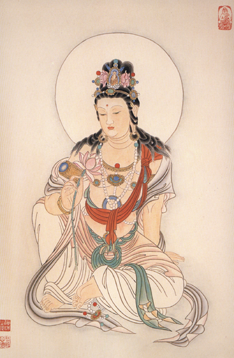

 more 

【題解】
本篇運用陰陽五行學說的理論，按照人體的膚色、體形、稟性、態度和對自然界變化的適應能力等方面的特徵，歸納總結出木、火、土、金、水五種不同的體質類型。再根據五音太少、陰陽屬性、體態和生理特徵等方面，又將每一類型劃分為五類，即成為二十五種體質類型。在分型的基礎上，進一步闡述了不同類型的個體在生理、病理和治療上的特異性，故篇名為「陰陽二十五人」。

【原文】
黃帝曰：余聞陰陽之人何如?
伯高曰：天地之間，六合之內[1]，不離於五，人亦應之。故五五二十五人之政，而陰陽之人不與焉。其態又不合於眾者五，餘已知之矣。

黃帝曰：願聞二十五人之形，血氣之所生，別而以候，從外知內何如?
岐伯曰：悉乎哉問也，此先師之秘也，雖伯高猶不能明之也。黃帝避席遵循而卻[2]日余聞之，得其人弗教，是謂重失得而泄之，天將厭之。餘願得而明之，金櫃藏之，不敢揚之。

岐伯曰：先立五形金木水火土，別其五色，異其五形之人，而二十五人具矣。

黃帝曰：願卒聞之。
岐伯曰：慎之慎之，臣請言之。木形之人，比於上角，似於蒼帝。其為人蒼色，小頭，長面，大肩背，直身，小手足，好有才，勞心，少力，多憂勞於事。能春夏不能秋冬，感而病生，足厥陰佗佗然[3]。大角之人，比于左足少陽，少陽之上遺遺然[4]。左角(一日少角)之人，比於右足少陽，少陽之下隨隨然[5]。鈦角(一日右角)之人，比於右足少陽，少陽之上推推然[6]引。判角之人，比于左足少陽，少陽之下栝栝然[7]

【注釋】
[1]六合之內：六合，指東、南、西、北四方和上、下。即宇宙間。
[2]遵循而卻：遵循，卻退貌，即不敢前進而後退，又非常恭敬的樣子。
[3]佗佗然：佗音駝。佗佗然，雍然自得之貌。
[4]遺遺然：美長而逶迤不斷。
[5]隨隨然：順從的樣子。
[6]推推然：積極進取的狀態。
[7]栝栝然：栝，音添。栝栝然，正直的樣子。

【提要】
以陰陽五行學說為基礎，用「同中求異」的方法，從五音太少、陰陽屬性、體態和生理特徵等方面論述了木型之人。

【詳解】
黃帝說：我聽說人有陰陽類型的不同，他們是如何區別的呢?伯高道天地宇宙之間的一切事物都稟受五行之氣，也離不開五行運動變化的道理，人也如此。根據人的先天稟賦不同，也各自體現著木、火、土、金、水五行性質的特徵。每一類型的人又表現出五種個體差異，所以，人群中體現了二十五種類型。然而二十五種人的形體特徵、性格特點與陰陽類型的人是不同的。陰陽類型的太陰之人、少陰之人、太陽之人、少陽之人、陰陽和平之人的情況我已經知道了。我想瞭解一下二十五種人的具體情況，以及由於血氣不同而產生的各種特點，如何從外部表現去測知內部的生理、病理情況呢?

岐伯說：問得真詳細啊！這是先師秘而不傳的，就是伯高也不能徹底明白其中的道理。黃帝離席後退幾步，很恭敬地說我聽說，遇到適當的人而不把學術理論傳授給他是重大損失，而得到了這種學術不加重視，隨便洩漏，將會受到上天的厭棄。我迫切希望獲得這種學術知識，並領會透徹，而後秘藏在金櫃，不隨便傳揚。

岐伯說：先明確木、火、土、金、水五種類型的人，後按照五色的不同加以區別，就容易知道二十五種人的形態了。

黃帝說：我希望聽你詳盡地講講。
岐伯道：一定要慎而又慎啊！就讓我給你講講吧。形體與性情木性的人，屬於木音中的上角，這類人的形態特徵是皮膚呈青色，象東方的蒼帝一樣，頭小面長，肩背寬大，身軀挺直，手足小，有才智，好施心機，體力不強，經常被事務困擾。對時令季節的適應是，耐受春夏不耐秋冬，秋冬季節容易感受病邪而發生疾病。此類人，類屬於足厥陰肝經，性格特徵是修美而穩重，是稟受木氣最全的人。另外還有四種稟受木氣不全的人，分左右上下四種在木音中屬於大角一類的人，在左上方，屬於左足少陽經之上，其特徵有柔退而畏縮不前的缺欠。在五音中屬於左角一類的人，在右下方，屬於右足少陽之下，其特徵有過於隨和順從、唯唯諾諾的缺點。在木音中屬於太角一類的人，在右上方，類屬於右足少陽經之上，其特徵是急功進利。在木音中屬於判角一類的人，在左下方，類屬左足少陽經之下，其特徵是剛正而缺乏靈活。

【原文】
火形之人，比於上徵，似於赤帝。其為人赤色，廣胤[1]，銳面小頭，好肩背髀腹，小手足，行安地，疾心，行搖，肩背肉滿，有氣輕財，少信，多慮，見事明，好顏，急心，不壽暴死。能春夏不能秋冬，秋冬感而病生，手少陰核核然[2]。質徵之人，比於左手太陽，太陽之上肌肌然[3]。少徵之人，比於右手太陽，太陽之下恬恬然嘲。右徵之人，比於右[4]手太陽，太陽之上鮫鮫然[5]。質判之人，比於左手太陽，太陽之下支支頤頤然[6]引。

【提要】
以陰陽五行學說為基礎，用「同中求異」的方法，從五音太少、陰陽屬性、體態和生理特徵等方面論述了火型之人的特徵。

【注釋】
[1]廣：刪鵬音引，脊肉。即背脊部的肌肉寬廣。
[2]核核然：核，通竅，空之意。核核然，即由於火氣上越而空虛之狀。
[3]肌肌然：「肌肌」，疑應為「眺眺」，形誤。「眺眺」，引申為月明貌。火性之人，取象於離，離為火、為明故也。肌肌然，即正大光明之狀。
[4]怊悃然：怊，音滔。多疑的樣子。
[5]鮫鮫然：鮫，音交。鮫鮫然，踴躍之意。
[6]支支頤：頤然形容怡然自得無憂無愁的樣子。

【詳解】
形體與性情稟承火性的人，屬於火音中的上徵，猶如南方的赤帝，這類人的特徵是皮膚呈紅色，齒根寬廣，顏面瘦而頭小，肩背腰腹及兩腿發育勻稱，手足小，步履急速，心性急，走路時身體搖擺，肩背肌肉豐滿，有氣魄而不重錢財，但少信用，多憂慮，觀察和分析事物敏銳而又透徹，容顏美好，性情急躁，不長壽而多暴死。這類人對時令的適應是，耐春夏的溫暖，不耐秋冬的寒冷，秋冬容易感受外邪而生病。這類人在五音中比為上徵，歸於手少陰心經，是稟承火氣最全的一類人，其外形特徵是對事物認識深刻，講求實效，雷厲風行。另有四種稟受火氣不全的人，分為左右上下四種左上方，在火音中類屬於質徵，歸左手太陽之上，火氣不足，其性格特徵是，光明正大而通曉事理。右下方，在火音中類屬於少徵，歸於右手太陽經之下，火氣不足，其特徵是，疑心太重。右上方，在火音中類屬於右徵，歸於右手太陽經之上，火氣不足，其特徵是，做事不甘落後，但行事魯莽。左下方，在火音中類屬於判徵，歸於左手太陽經之下，火氣不足，其特徵是，樂觀、怡然自得而無憂無慮。

【原文】
土形之人，比于上宮，似于上古黃帝。其為人黃色，圓面，大頭，美肩背，大腹，美股脛，小手足，多肉，上下相稱，行安地，舉足浮，安心，好利人，不喜權勢，善附人也。能秋冬不能春夏，春夏感而病生，足太陰敦敦然[1]。太宮之人，比于左足陽明，陽明之上婉婉然[2]。加宮之人，比于左足陽明，陽明之下坎坎然[3]引。少宮之人，比于右足陽明，陽明之上樞樞然[4]。左宮之人，比于右足陽明，陽明之下兀兀然[5]。

【提要】
以陰陽五行學說為基礎，用「同中求異」的方法，從五音太少、陰陽屬性、體態和生理特徵等方面論述了土型之人的特徵。

【注釋】
[1]敦敦然：誠懇而忠厚的樣子。
[2]婉婉然：和順的樣子。
[3]坎坎然：《爾雅》釋訓「坎坎，喜也。」坎坎然，喜悅的樣子。
[4]樞樞然：圓滑的樣子。
[5]兀兀然：兀，音勿。兀兀然，獨立不動的樣子。

【詳解】
形體與性情稟承土性的人，屬於土音中的匕宮，宛如中央的黃帝，這類人的形態特徵是黃色皮膚，大頭圓臉，肩背豐滿而健美，腰腹壯大，兩腿健壯，手足小，肌肉豐滿，身體各部發育勻稱，步態輕盈而又穩健。性情安穩自若，沉著冷靜，不驕不躁，助人為樂，不爭逐權勢，善於團結人。這種類型的人對時令的適應是，能耐秋冬的寒涼，不能耐春夏的溫熱，春夏容易感受外邪而生病。這一類型的人在土音中稱為上宮，屬於足太陰脾經，是稟受土氣最全的人，性格特徵是誠懇而忠厚。稟承土氣不全者也分為左右上下四種左上方，土音中屬於大宮，類屬於左足陽明經之上，土氣不足，這種人的特徵是，過於柔順。左下方，在土音中屬於加宮者，類屬左足陽明經之下，土氣不足，其特徵是神情欣喜快活。右上方，土音中類屬於少宮者，屬於右足陽明經之上，土氣不足，這類人的特徵是，為人圓滑，左右逢源。右上方，土音中類屬於左宮者，屬於右足陽明經之下，土氣不足，其特徵是神情呆滯。

【原文】
金形之人，比于上商，似于白帝。其為人方面，白色，小頭，小肩背，小腹，小手足，如骨發踵外，骨輕，身清廉，急心，靜悍，善為吏。能秋冬不能春夏，春夏感而病生。手太陰敦敦然。鈦商之人，比于左手陽明，陽明之上廉廉然。右商之人，比于左手陽明，陽明之下脫脫然[z-。大商之人，比于右手陽明，陽明之上監監然。少商之人，比于右手陽明，陽明之下嚴嚴然。

【提要】
以陰陽五行學說為基礎，用「同中求異」的方法，從五音太少、陰陽屬性、體態和生理特徵等方面論述了金型之人的特徵。

【詳解】
形體與性情稟承金性的人，屬於金音中的上商，好比西方的白帝，這類人的形態特徵是皮膚白，小頭方臉，小肩背，小腹，手足小，足跟部骨骼顯露，行走輕快，稟性廉潔，性急，平常沉靜，行動迅猛，強悍異常，具有領導才能，善於判斷。對時令的適應是，能耐受秋冬的寒涼，不能耐受春夏的溫熱，春夏易感受邪氣而患病，這一類型的人，在金音中稱為上商，屬手太陰肺經，是稟受金氣最全的人，其性格特徵是刻薄而寡恩，嚴厲而冷酷。此外，稟受金氣不全的人分為左右上下四種左上方，金音中屬於鈦商一類者，屬左手陽明經之上，金氣不足，其特徵是，廉潔自律。左下方，金音中屬於右商一類的人，屬左手陽明之下，金氣不足，其特徵是，清俊灑脫。右上方，金音中類屬太商者，歸於右手陽明經之上，金氣不足，其特徵是，善於明察秋毫。右下方，在金音中屬於少商一類的人，歸於右手陽明經之下，金氣不足，其特徵是，威嚴而莊重。

【原文】
水形之人，比於上羽，似于黑帝。其為人黑色，面不平，大頭，廉頤，小肩，大腹，動手足，發行搖身，下尻長，背延延然，不敬畏，善欺紿人，戮死。能秋冬不能春夏，春夏感而病生。足少陰汗汗然。大羽之人，比於右足太陽，太陽之上頰頰然。少羽之人，比于左足太陽，太陽之下紆紆然。眾之為人，比於右足太陽，太陽之下潔潔然。桎之為人，比于左足太陽，太陽之上安安然。是故五形之人二十五變者，眾之所以相欺者是也。

【提要】
以陰陽五行學說為基礎，用「同中求異」的方法，從五音太少、陰陽屬性、體態和生理特徵等方面論述了水型之人的特徵。

【詳解】
形體與性情稟承水性的人，屬於水音中的上羽，就像北方的黑帝。這類人的形態特徵是皮膚黑，顏面凹凸不平，大頭顱，臉龐寬廣，肩小腹大，手足喜動，走路時身體搖擺晃動，腰背及臀尾部較長，對人的態度既不恭敬又不畏懼，善於欺詐，常因作惡而被殺身喪命。在對時令的適應上，耐秋冬的寒冷，不耐春夏的溫熱，春夏季節容易感受邪氣而發病。在水音中稱為上羽，屬於足少陰腎經，是稟受水氣最全的人，其特徵是，人格卑下，邪惡奸詐。還有左右上下稟受水氣不全的四種人右上方，水音中屬於太羽者，類屬右足太陽經之上，水氣不足，其性格特徵是，心情經常鬱悶不舒。
左下方，水音中屬於少羽之人，類屬左足太陽之下，水氣不足，其性格特徵是，情感曲折周旋。右下方，水音中屬於眾羽者，類屬右足太陽經之下，水氣不足，其特徵是，文靜而又清高。左上方，水音中屬於桎羽一類者，類屬左足太陽經之上，水氣不足，其特徵是，安定而拘束。

木

火

土

金

水

比于上角，似于蒼帝。

比于上徵，似于赤帝。()()

比于上宮，似于上古黃帝。

比于上商，似于白帝。

比于上羽，似于黑帝。

能春夏不能秋冬， 

能春夏不能秋冬，

能秋冬不能春夏，

能秋冬不能春夏，

能秋冬不能春夏，

太角之人，

質徵（一曰太徵。）之人，

太宮之人，

釱商之人，

太羽之人，

左角（一曰少角。）之人，

少徵之人，

加宮之人，（一曰衆之人。）比于左足陽明，

右商之人，

小羽之人，

釱角之人，

右徵之人，（一作熊熊。）然。 

少宮之人，

左商之人，

衆之爲人，（一作加之人。）比于右足太陽，

判角之人，

質判之人，

左宮之人，（一作上，非。）兀兀然。 

少商之人，

桎之爲人，

【按語】
本文將人的體質以五行為標誌，分為五大類型，又分為二十五種不同的形態和性格。每一行中都有一種類型的人是稟本氣最全者，還有四種是得本氣之偏者。提示我們在臨床辨證和治療時，要注意人體稟賦不同，因人制宜。

【原文】
黃帝曰：得其形，不得其色，何如?
岐伯曰：形勝色，色勝形者，至其勝時年加，感則病行，失則憂矣。形色相得者，富貴大樂。

黃帝曰：其形色相勝之時，年加可知乎?。
岐伯曰：凡年忌上下之人大忌常加，七歲，十六歲，二十五歲，三十四歲，四十三歲，五十二歲，六十一歲，皆人之大忌，不可不自安也，感則病行，失則憂矣。當此之時，無為奸事，是謂年忌。

黃帝曰：夫子之言，脈之上下，血氣之候，以知形氣奈何?
岐伯曰：
足陽明之上，血氣盛則髯美長；血少氣多則髯短故氣少血多則髯少；血氣皆少則無髯，兩吻多畫。
足陽明之下，血氣盛則下毛美長至胸血多氣少則下毛美短至臍，行則善高舉足，足指少肉，足善寒；血少氣多則肉而善瘃血氣皆少則無毛，有則稀枯悴，善痿厥足痹。

足少陽之上，氣血盛則通髯美長；血多氣少則通髯美短血少氣多則少髯，血氣皆少則無須，感於寒濕則善痹，骨痛爪枯也。
足少陽之下，血氣盛則脛毛美長，外踝肥；血多氣少則脛毛美短，外踝皮堅而厚；血少氣多則珩毛少，外踝皮薄而軟；血氣皆少則無毛，外踝瘦無肉。

足太陽之上，血氣盛則美眉，眉有毫毛；血多氣少則惡眉，面多少理；血少氣多則面多肉；血氣和則美色。
足太陽之下，血氣盛則跟肉滿，踵堅；氣少血多則瘦，跟空；血氣皆少則喜轉筋，踵下痛。

手陽明之上，血氣盛則髭美；血少氣多則髭惡血氣皆少則無髭。
手陽明之下，血氣盛則腋下毛美，手魚肉以溫氣血皆少則手瘦以寒。

手少陽之上，血氣盛則眉美以長，耳色美；血氣皆少則耳焦惡色。
手少陽之下，血氣盛則手卷多肉以溫；血氣皆少則寒以瘦；氣少血多則瘦以多脈。

手太陽之上，血氣盛則多須，面多肉以血氣皆少則面瘦惡色。
手太陽之下，血氣盛則掌肉充滿；血氣皆少則掌瘦以寒。

【提要】
本段論述了因氣血盛衰出現在不同部位的生理特徵，以及從這些特徵來測候氣血的盛衰和臟腑內在變化的內容。

【詳解】
黃帝問道：從五行理論的角度，人體已經具備了相應的體形特徵，但並未顯示出各型應出現的膚色，又將如何呢?
岐伯回答說：按照五行生克的原理，形體的五行屬性克制膚色的五行屬性，或膚色的五行屬性克制形體的五行屬性，出現形色相克的現象，適逢年忌相加，再感受了病邪就會生病，若失治、誤治，或自己疏忽，不重視保養，難免有性命之憂。若形色相稱，為形質氣機調和，是平安康泰的表現。

黃帝問道：在形色相克制之時，年忌的相加能夠知道嗎?
岐伯回答說：一般人重大的年忌，從七歲這一大忌之年算起，以後在此基數上遞加九年，即十六歲、二十五歲、三十四歲、四十三歲、五十二歲、六十一歲，這些年齡，都是大忌之年。要注意精神和身體的調養與保護，在生活起居和行為上，千萬不要自我損害，不然容易感受病邪而發生疾病。若發生疾病之後又疏於調治，便會有生命之憂。所以，在上述年齡時，要謹慎保養，預防疾病的發生，更不要做那些奸邪之事，以免損傷精神和身體，以上講的就是年忌。

黃帝問道：你曾說根據經脈在人體的上下循行和氣血的多少變化，來體察反映到體表的現象，究竟如何呢?
岐伯回答說：
循行於人體上部的足陽明經脈，如果氣血充盛，兩側面頰的鬍鬚美好而長。血少氣多，面頰部的鬍鬚就短。氣少血多，面頰部的鬍鬚就稀少。血氣均少則兩頰部完全無鬍鬚、口角兩旁的紋理很多。

循行於人體下部的足陽明胃經，如果氣血充盛，下部的毫毛美好而長，毛可上至胸部。血多氣少則下部的毫毛雖美，但較短少，毛可上至臍部，走路時喜歡高抬腳，足趾的肌肉較少，足部常覺寒冷。血少氣多則容易生凍瘡。血氣均不足，下部毫毛不生，即便有也很稀少且顯枯槁，這種人易患痿、厥、痹等病。

循行於人體上部的足少陽經脈，若氣血充盛，面頰兩側鬍鬚連鬢而生、美好而長。如果血多氣少，兩頰鬍鬚連鬢，雖美但較短小。血少氣多則少長鬍鬚。血氣都不足則鬍鬚不生，感受寒邪濕氣容易患痹證、骨痛、爪甲乾枯等證。
循行於下部的足少陽經脈，若氣血充盛，則腿脛部的毛美好而長，外踝附近的肌肉豐滿。如果血多氣少則腿脛部的汗毛雖美好但較短小，外踝周圍皮堅而厚。若血少氣多則腿脛部的毛少，外踝周圍皮薄而軟。血氣都少則毛不生，外踝處瘦而沒有肌肉。

循行於上部的足太陽經脈，若氣血充盛，則眉毛清秀而長，眉毛中並見長的毫毛。如果血多氣少，則眉毛枯瘁，臉面部多見細小的皺紋。血少氣多，面部的肌肉就豐滿，氣血調和則顏面秀麗。
循行於下部的足太陽經脈，若氣血充盛，則足跟部肌肉豐滿而堅實。如果氣少血多則足跟部肌肉消瘦。氣血均少者，容易發生轉筋、足跟痛等症。

手陽明經脈的上部氣血充盛，則唇上鬍鬚清秀而美。若血少氣多，則唇上鬍鬚稀疏無華。血氣都少則唇無鬍鬚。
手陽明經脈的下部氣血充盛，腋毛秀美，手部的肌肉經常是溫暖的。若氣血都不足，則手部肌肉消瘦而且寒涼。

手少陽經脈的上部氣血充盛，則眉毛美好而長，耳部的色澤明潤。氣血均不足則耳部焦枯無華。
手少陽經脈的下部氣血充盛，則手部的肌肉豐滿，並且常覺溫暖。氣血均不足，則手部肌肉消瘦並且寒涼。氣少血多則手部肌肉消瘦，並且絡脈多浮顯而易見。

手太陽經脈的上部血氣充盛，唇下多鬍鬚，面部豐滿。血氣少則面部消瘦無光華。
手太陽經脈的下部氣血充盛，則掌上肌肉充實而豐滿。氣血少則掌部肌肉消瘦而寒涼。

【原文】
黃帝曰：二十五人者，刺之有約[1]乎?
岐伯曰：美眉者，足太陽之脈氣血多；惡眉者，血氣少；其肥而澤者，血氣有餘肥而不澤者，氣有餘，血不足；瘦而無澤者，氣血俱不足。審察其形氣有餘不足而調之，可以知逆順矣。

黃帝曰：刺其諸陰陽奈何?
岐伯曰：按其寸口人迎，以調陰陽，切循其經絡之凝澀，結而不通者，此於身皆為痛痹，甚則不行，故凝澀。凝澀者，致氣以溫之，血和乃止。其結絡者，脈結血不和，決之乃行。故日氣有餘於上者，導而下之氣不足於上者，推而休之；其稽留不至者，因而迎之；必明於經隧，乃能持之。寒與熱爭者，導而行之；其宛陳血不結者，則而予之。必先明知二十五人，則血氣之所在，左右上下，刺約畢也。

【提要】
根據二十五種人的不同特點，提出了不同的治療原則、取穴標準、操作手法等。

【詳解】
黃帝問道：這二十五種類型的人，在針刺治療時，有一定的規則嗎?
岐伯回答說：眉毛清秀美好，是足太陽經脈氣血充盛。眉毛稀疏無華，是該經脈氣血均少。人體肌肉豐滿而潤澤，是氣血有餘。肥胖而不潤澤，是氣有餘而血不足。消瘦而不潤澤的是氣血均不足。根據人形體的外在表現和體內氣血的有餘與不足，便可見知疾病的虛實、病勢的順逆，這樣就能做出恰當的治療，不致貽誤病機。

黃帝問：怎樣去針刺三陰三陽經脈所患的病變呢?
岐伯答道：切按人迎、寸口脈，以診察陰陽氣血盛衰的變化，再沿著經絡循行的部位，審視有無結聚等氣血滯澀不通的現象。若氣血阻滯不通，一般是患痛痹之病，是陽氣嚴重不足，氣行不暢，導致血液凝滯，治當用針刺調補氣機，使陽氣運行至該部位，以溫通其澀滯的氣血，待氣血通調後，才能停止治療。若氣血結聚在小的絡脈而造成淺部瘀血，治當用針刺放血來開決疏通，氣血即可運行。所以，凡上部病氣有餘的，應採取上病下取的取穴方法，引導病氣下行。凡上部正氣不足的，用推而揚之的針法，促使正氣上行，使氣血達到新的平衡。若氣遲遲不至而沒有針感，或是氣行遲滯而中途滯留，應在滯留之處用針迅速刺治，以接引其氣，使其運達病所。要先明確經脈的循行，才能正確採用各種不同的針刺方法。若出現寒熱交爭的現象，應根據陰陽盛衰的不同情況，補其不足而泄其有餘，調理氣血達到平衡。若脈中雖有鬱滯而尚未瘀結的，也應區別不同情況，給予不同的治療。總之，必須首先熟悉二十五種人的不同外部特徵、各部經脈上下氣血的盛衰、以及內部的病理機制等具體情況，接下來針刺的各種方法和原則，也就能依此而定了。

知人不必言盡　留三分餘地與人　留些口德與己