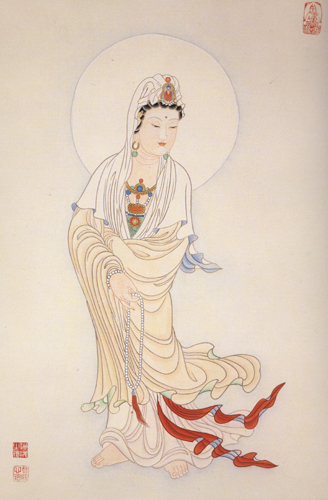

【題解】
百病，泛指一切疾病。始生，指引起人體發生疾病的初始原因。因本篇主要論述了疾病的病因分類、外感病發生的機理及傳變層次，所以篇名為「百病始生」。

 more 

【原文】
黃帝問于岐伯曰：夫百病之始生也，皆生於風雨寒暑，清濕喜怒。喜怒不節則傷臟，風雨則傷上，清濕則傷下。三部之氣，所傷異類，願聞其會。
岐伯曰：三部之氣各不同，或起于陰，或起于陽，請言其方。喜怒不節則傷臟，臟傷則病起于陰也；清濕襲虛，則病起於下；風雨襲虛，則病起於上，是謂三部。至於其淫浹，不可勝數。

【提要】本段主要論述了疾病的病因分類。

【詳解】
黃帝問：岐伯道各種疾病的產生，都是由於風、雨、寒、暑、陰冷、潮濕等邪氣的侵襲和喜怒哀樂等情志所傷。喜怒不加節制，會使內臟受損傷。風雨寒暑之邪，則傷人體外部。風雨之邪，會損傷人體的上部；陰寒潮濕之邪，會侵害人體的下部。造成人體上部、內部和下部損害的三種邪氣不同，我想聽聽其中的道理。
岐伯回答說：喜、怒、哀、樂是人的情感，風、雨、寒、暑屬於氣候變化，陰冷潮濕則為大地環境，從致病的角度，他們是三種不同性質的邪氣，所以有的先發生在陰分，有的先發生在陽分，我就此講講其中的道理。凡喜怒不節等情志不調而發病的，則內傷五臟，五臟屬陰，所謂病起于陰。陰冷潮濕這種邪氣容易乘虛侵害人體下部，所謂病起於下。風雨寒暑之邪容易侵襲人體的上部，所謂病起於上。這是根據邪氣的致病特點分為三個方面。至於邪氣侵襲人體而引起的各種變化，就更加複雜，難以計數了。

【原文】
黃帝曰：餘固不能數，故問先師，願卒聞其道。
岐伯曰：風雨寒熱，不得虛，邪不能獨傷人。卒然逢疾風暴雨而不病者，蓋無虛，故邪不能獨傷人。此必因虛邪之風，與其身形，兩虛相得，乃客其形，兩實相逢，眾人肉堅。其中於虛邪也，因于天時，與其身形，參以虛實，大病乃成，氣有定舍，因處為名，上下中外，分為三員。是故虛邪之中人也，始於皮膚，皮膚緩則腠理開，開則邪從毛髮入，入則抵深，深則毛髮立，毛髮立則淅然，故皮膚痛。留而不去，則傳舍於絡脈，在絡之時，痛於肌肉，其痛之時息，大經乃代[1]留而不去，傳舍於經，在經之時，灑淅喜驚。留而不去，傳舍於輸，在輸之時，六經不通，四肢則肢節痛，腰脊乃強。留而不去，傳舍於伏沖之脈，在伏沖之時，體重身痛。留而不去，傳舍於腸胃，在腸胃之時，賁響腹脹，多寒則腸鳴飧泄，食不化，多熱則溏出糜[2]。留而不去，傳舍於腸胃之外、募原之間，留著於脈，稽留而不去，息而成積。或著孫脈，或著絡脈，或著經脈，或著輸脈，或著於伏沖之脈，或著於膂筋[3]或著於腸胃之募原，上連於緩筋[4]川，邪氣淫浹，不可勝論。

【提要】
主要論述了外感病發生的機理，提出了「兩虛相得，乃客其形」的論點；並論述了外感病傳變的規律。

【注釋】
[1]大經：乃代大經，經脈，與絡脈相對而言。大經乃代，指邪氣深人，經脈代絡脈受邪。
[2]溏出：麋泛指瀉痢。
[3]膂筋：指附於脊膂之筋。
[4]緩筋：泛指足陽明筋。

【詳解】
黃帝說：我對千變萬化的病情當然不能講清楚，所以才請教你，希望徹底明白其中的道理。岐伯道風雨寒熱之邪，若不是遇到身體虛弱，一般是不能侵害人體而致病的。突然遇到狂風驟雨而不生病，是因為他的身體健壯而不虛弱，邪氣一般不能單獨傷人致病。所以疾病的產生，首先是身體虛弱，又感受了賊風邪氣的侵襲，兩種因素相結合，才會產生疾病。一般人們在實際生活中，若身體強壯，肌肉堅實，四時之氣也正常，就不容易發生疾病。凡是疾病的發生，決定於四時氣候是否正常，以及身體素質是否強壯，即人體正氣不足而邪氣盛，就會發生疾病。邪氣一般都根據其不同性質侵襲人體的一定部位，再根據不同的發病部位而確定其名稱。人體從縱向劃分為上、中、下三部；從橫向層次劃分為表、裏和半表半裏三部。所以虛邪賊風侵襲人體，先從最表層的皮膚開始，若皮膚不能收固緻密，腠理就會開泄，邪氣趁機從毛孔而入，若逐漸向深處侵犯，一般會出現惡寒戰慄，毫毛悚然豎起，皮膚也會出現束緊疼痛的感覺。若邪氣滯留不除，就會漸漸傳到絡脈，邪氣在絡脈的時候，肌肉可出現疼痛。疼痛時作時止，是邪氣將由絡脈傳到經脈。若病邪得不到解除而滯留在經脈，不時會出現刹那間的顫抖和驚悸的現象。邪氣滯留不散可傳人並潛伏在輸脈，其在輸脈時，足太陽經的六經俞穴受病，六經之氣被邪氣阻滯而不能通達四肢，四肢關節因而疼痛，腰脊也強痛不適。若邪氣滯留不祛，則傳人脊內的沖脈，沖脈受犯，就會出現體重身痛的症狀。若邪氣滯留不能祛除，會進一步深入並藏伏在腸胃，邪在腸胃會出現腸鳴腹脹等症狀。寒邪亢盛，則泄瀉完穀不化；熱邪亢盛，則濕熱下利或大便如糜而肛門灼熱。如果邪氣滯留尚不能祛除，傳到腸胃之外半表半裏的募原，留著於血脈之中，邪氣就會與氣血相互凝結，久則聚結為積塊。總之，邪氣侵犯人體後，或留在小的孫絡、或留在絡脈、或留在經脈，或留在輸脈，或留在伏沖之脈，或留存替筋，或留在腸胃外的募原，上連緩筋，邪氣浸淫氾濫人體各個組織而造成各種各樣的疾病，難以言盡。

【原文】
黃帝曰：願盡聞其所由然。
岐伯曰：其著孫絡之脈而成積者，其積往來上下，臂[1]手孫絡之居也，浮而緩，不能句積而止之[2]，故往來移行，腸胃之間水，湊滲注灌，濯濯有音，有寒則膜膜滿雷引[3]，故時切痛。其著于陽明之經，則挾臍而居，飽食則益大，饑則益小。其著於緩筋也，似陽明之積，飽食則痛，饑則安。其著于腸胃之募原也，痛而外連於緩筋，飽食則安，饑則痛。其著於伏沖之脈者，揣揣應手而動，發手則熱氣下於兩股，如湯沃[4]之狀。其著於膂筋，在腸後者，饑則積見，飽則積不見，按之不得。其著於輸之脈者，閉塞不通，津液不下，孔竅千壅，此邪氣之從外入內，從上下也。

黃帝曰：積之始生，至其已成奈何?
岐伯曰：積之始生，得寒乃生，厥乃成積也。

黃帝曰：其成積奈何?
岐伯曰：厥氣生足悅，挽生脛寒，脛寒則血脈凝澀，血脈凝澀則寒氣上入於腸胃，入於腸胃則膜脹，膜脹則腸外之汁沫迫聚不得散，日以成積。卒然多食飲，則脈滿，起居不節，用力過度，則絡脈傷。陽絡傷則血外溢，血外溢則衄血陰絡傷則血內溢，血內溢則後血。腸胃之絡傷，則血溢於腸外，腸外有寒，汁沫與血相摶，則併合凝聚不得散而積成矣。卒然外中於寒，若內傷於憂怒，則氣上逆，氣上逆則六輸不通，溫氣不行，凝血蘊裹而不散，津液澀滲，著而不去，而積皆成矣。

【提要】本段論述了積證位於不同部位的症狀表現，以及積證形成的病因病機。

【注釋】
[1]臂：據《甲乙經》為「擘」，擘，聚集之意。
[2]句積而止之句：同「拘」，約束之意。即約束使之固定不移。
[3]膜膜滿雷引：胰，音琛，脹。膜胰滿即胸腹脹滿。雷引，指腸中雷鳴並牽引疼痛。
[4]湯沃湯：熱水；沃，澆灌。湯沃，形容熱痛如熱水澆灌。

【詳解】
黃帝說：我希望你能將其始末原因，內在機理講給我聽。
岐伯道：邪氣停留在孫絡而形成的積，疼痛點上下遊動，因積停著于孫絡，而孫絡表淺而又鬆弛，所以不能拘束積於一處而使之固定不移，疼痛表現呈遊動性。如果積停留於腸胃問的孫絡，則腸胃之間的水液滲透灌注，則會形成水液停聚，吸收代謝失調，有時發出濯濯的水聲。寒邪盛則陽不化水，上下不運，氣機不通，腹部脹滿雷鳴，並出現刀割樣疼痛。若邪氣留著在足陽明經而形成積滯，積滯位於臍的兩旁，飽食後則積塊顯大，饑餓空腹時積塊變小。如果邪氣留著在緩筋而成積，其形狀表現和陽明經的積塊相似，但疼痛的特點是飽食則出現疼痛，饑餓時則不痛。邪氣留著在腸胃之膜原而成積，疼痛時牽連到腸外的緩筋，特點是飽食後不痛、饑餓時疼痛。邪氣留著在伏沖之脈而成積，用手切按腹部，積搏動應手，並隨著搏動而陣陣作痛。舉手時則患者自覺有一股熱氣下行，放射到兩股之間，就像用熱湯澆灌一樣，難以忍受。邪氣留著在膂筋而成積，饑餓時腸胃空虛，積形可以觸摸得到，飽食後腸胃充實則觸摸不到。邪氣留著在輸脈而成積，脈道閉塞不通，津液不能上下輸布，汗孔或其他孔竅乾澀，壅塞不通。這些都是邪氣從外部侵犯到內部，從上部而轉變到下部的臨床表現。

黃帝問：積病從發生到形成，其發展過程是怎樣的呢?
岐伯答道：積病的起始，是受到寒邪的侵害而發生的，主要是寒邪厥逆上行而生成積病。

黃帝又問：寒邪導致積病的病理過程是怎樣的呢?
岐伯答道：，寒邪造成厥逆之氣，先使足部陽氣不通，血液凝澀，逐漸又導致脛部寒冷，脛部寒冷進而使血脈凝滯，久之，寒冷之邪上逆進入腸胃，導致氣機不通而腹脹，腹脹則腸道外組織間的水液汁沫聚積不得消散，這樣日益加重而形成積病。又因突然暴食暴飲，使腸胃經脈過於充盈，或因生活起居不慎，或因用力過度，均可以使細小的絡脈損傷。若表淺的陽絡受到損傷，血會外溢，表現出各種衄血的症狀。若深部的陰絡受到損傷，血則內溢，血內溢就出現便血的症狀。砉腸胃的絡脈受到損傷，血就溢散到腸道外的腹腔組織間，適逢腸外有寒邪寄留，腸外的水液汁沫同外溢的血液相搏結，凝聚在一起不能消散而發展成為積病。此外，外感寒邪，內又有憂傷思慮，或是鬱怒憤悶等情志損傷，使氣機紊亂、上逆，繼而影響六經氣血運行不暢，陽氣不運，不能溫煦血液而形成凝血，凝血蘊結裹束不得消散，津液滲透不利，留著而不得布散，積病就形成了。

【原文】
黃帝曰：其生於陰者奈何?
岐伯曰：憂思傷心重寒傷肺；忿怒傷肝醉以入房，汗出當風傷脾；用力過度，若入房汗出浴，則傷腎。此內外三部之所生病者也。

黃帝曰：善。治之奈何?岐伯答曰：察其所痛，以知其應，有餘不足，當補則補，當瀉則瀉，毋逆天時，是謂至治。

【提要】
本段進一步論述了「病起于陰」

【詳解】
黃帝問：那些「病生於陰」的致病因素又有哪些呢?
岐伯答道：憂愁思慮過度則傷心，在寒飲寒食的基礎上又感受風寒之邪，雙重的寒邪損傷肺臟。忿恨惱怒過度則肝臟受傷。酒醉後行房事，汗出又受風，則脾臟受傷。用力過度，或行房事而大汗淋漓如同剛剛出浴，就容易損傷腎臟。

上述就是內外三部發生疾病的一般規律。
黃帝說：說得好。怎樣治療呢?

岐伯答道：，審察疼痛的特點和部位，就可以知道病變之所在，根據其虛實和各種證候表現，當補則補、當瀉則瀉，同時不要違背四時氣候和臟腑的關係，這就是正確的治療原則。

~人是否快樂，不取決於外在的財富，而是取決於自己的生活態度。 ~