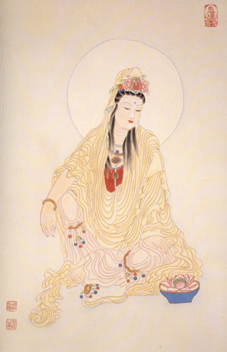

【題解】
行針，一是指針刺治療的全過程，二是指針刺後運針。因為本篇主要論述了由於人的體質不同，針刺後的反應也不同，以及針刺操作正確與否同療效的關係等針刺有關問題，故篇名為「行針」。

【原文】
黃帝問于岐伯曰：余聞九針于夫子，而行之于百姓，百姓之血氣各不同形，或神動而氣先針行；或氣與針相逢或針已出氣獨行；或數刺乃知；或發針而氣逆或數刺病益劇，凡此六者，各不同形，願聞其方。
岐伯曰：重陽之人，其神易動，其氣易往也。

黃帝曰：何謂重陽之人?
岐伯曰：重陽之人，煸煸叫高高，言語善疾，舉足善高，心肺之臟氣有餘，陽氣滑盛而揚，故神動而氣先行。

黃帝曰：重陽之人而神不先行者，何也?
岐伯曰：此人頗有陰者也。

黃帝曰：何以知其頗有陰也?
岐伯曰：多陽者多喜，多陰者多怒，數怒者易解，故日頗有陰，其陰陽之離合難，故其神不能先行也。

【提要】
本段主要論述不同體質的人對針刺有不同的反應，以及重陽之人針刺反應出現的機理。

【注釋】
[1]熵熵口邑，音賀。熵熵，即火熱熾盛。

【詳解】
黃帝問岐伯道：我從先生這裏瞭解了有關九針的理論，在施治過程中，發現人們的血氣盛衰是不一樣的，對針刺的反應也有明顯的差異。有的在進針之前神情就有了變化，精神高度緊張，並對針感有強烈的反應。有的進針後馬上就有得氣的感覺。有的在出針後才有反應。還有的很不敏感，經過數次針刺才有反應。有的甚至下針後就出現氣逆、暈針等不良反應。更有甚者，經過幾次針刺治療後病情反而加重。上述六種情況，表現各不相同，我想知道其中的道理。
岐伯回答說：重陽類型的人，易於激動，表現為高度敏感，對針感反應很強烈。

黃帝問：重陽類型的人是什麼樣呢?
岐伯答道：重陽類型人的神氣稟性如同火一樣轟轟烈烈，精力充沛，說話爽朗流利，趾高氣揚。因為這種人的心肺臟氣有餘，功能旺盛，陽氣充盛滑利而易發越激揚，所以他的神情易於激動而對針刺反應強烈。

黃帝問：有些重陽類型的人，神情並不易激動，這是什麼道理呢?
岐伯回答說：這種人雖然陽氣熾盛，但陰氣也盛，陽中有陰。

黃帝又問：怎麼知道這種人陽中有陰呢?
岐伯答道：多陽的人情緒高漲，精神愉快，常喜形於色。多陰則精神抑鬱，心情緊張，經常惱怒不快，好發脾氣，但很容易緩解，根據上述特點說明這種人陽中有陰。所以陽為陰滯，陰陽離合困難，神氣就不易激動，反應也不那麼強烈。

【原文】
黃帝曰：其氣與針相逢奈何?
岐伯曰：陰陽和調而血氣淖澤滑利，故針入而氣出，疾而相逢也。

黃帝曰：針已出而氣獨行者，何氣使然?
岐伯曰：其陰氣多而陽氣少，陰氣沉而陽氣浮者內藏，故針已出，氣乃隨其後，故獨行也。

黃帝曰：數刺乃知，何氣使然?
岐伯曰：此人之多陰而少陽，其氣沉而氣往難，故數刺乃知也。

黃帝曰：針入而氣逆者，何氣使然?
岐伯曰：其氣逆與其數刺病益甚者，非陰陽之氣，浮沉之勢也，此皆粗之所敗，上之所失[1]，其形氣無過焉。

【提要】本段主要論述不同體質的人對針刺有不同反應的機理。

【注釋】
[1]上之所失：據《太素》應為「工之所失」。

【詳解】
黃帝問：有的患者對針刺很敏感，下針後很快得氣，這是什麼道理呢?
岐伯答道：這是因為人的陰陽均衡協調，氣血濡潤和暢，所以進針以後就很快出現得氣的反應。

黃帝又問：有的人在起針以後，才出現反應，其內在的機制是什麼呢?
岐伯回答說：因為這種人多陰而少陽，陰的性質主沉降，陽的性質主升浮，陰偏盛則沉潛斂藏佔優勢，所以針刺時反應遲緩，當出針以後，陽氣隨其針而上浮，才出現反應。

黃帝問：經過幾次針刺治療才出現反應，是什麼道理呢?
岐伯答道：這是因為這種人多陰而少陽，其氣機沉潛至深，反應低下而氣難至，對針刺極不敏感，所以通過幾次針刺後才出現反應。

黃帝問：有的人剛剛進針即出現氣逆暈針的不良反應，這是什麼道理?
岐伯答道：進針後出現氣逆暈針的不良反應，還有經過多次針刺治療後病情反而加重惡化者，並不是患者的體質陰陽偏盛偏衰，以及氣機的升浮沉降造成的，都是因為醫生本身技術不高明，是治療上的失誤，與患者的形氣體質無關。

~貪求心也好，嫉妒心也好，傲慢心也好，愚癡心也好，心量狹隘也好，這些都是惡心。 ~
