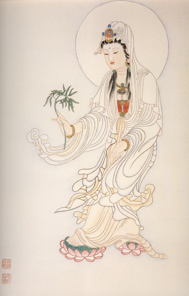

【題解】
邪客，是指邪氣侵犯人體。本篇以邪氣侵犯人體後所形成的失眠證為主，論述了相關內容，所以篇名為「邪客」。

【原文】
黃帝問于伯高曰：夫邪氣之客人也，或令人目不瞑不臥出者，何氣使然?
伯高曰：五穀入於胃也，其糟粕、津液、宗氣分為三隧[1]，故宗氣積於胸中，出於喉嚨，以貫心脈，而行呼吸焉。營氣者，泌其津液，注之於脈，化以為血，以榮四末，內注五臟六腑，以應刻數[2]焉。衛氣者，出其悍氣之愫疾，而先行於四末、分肉、皮膚之間，而不休者也。晝日行于陽，夜行于陰，常從足少陰之分間，行於五臟六腑。今厥氣客於五臟六腑，則衛氣獨衛其外，行于陽，則陽蹺滿，不得入于陰，陰虛，故目不瞑。

黃帝曰：善。治之奈何?
伯高曰：補其不足，瀉其有餘，調其虛實，以通其道，而去其邪。飲以半夏湯一劑，陰陽已通，其臥立至。

黃帝曰：善。此所謂決瀆壅塞，經絡大通，陰陽和得者也。願聞其方。
伯高曰：其湯方以流水千里以外者八升，揚之萬遍，取其清五升煮之，炊以葦薪，火沸，置秫米一升，治半夏五合，徐炊，令竭為一升半，去其滓，飲汁一小杯，日三，稍益，以知為度。故其病新發者，複杯則臥，汗出則已矣；久者，三飲而已也。

【提要】
主要論述了失眠證的病機和治法。

【注釋】
[1]三隧：張介賓註：「隧，道也。糟粕之道，出於下焦；津液之道出於中焦；宗氣之道，出於上焦。故分為三隧。」
[2]以應刻數古代以一晝夜分為一百刻，用於計算時間。營氣循行周身，一晝夜為五十周次，恰巧與百刻之數相應。

【詳解】
黃帝問伯高道：邪氣侵襲人體，有時令人不能閉目安眠，為什麼呢?
伯高回答說：食物進入胃中，通過消化吸收後，宗氣聚于上焦，津液出於中焦，糟粕由下焦排出體外，即進人體內的食物共有三條走向。上焦的宗氣積聚在胸中，上出於喉嚨，貫通心肺而行呼吸之氣。中焦化生營氣，分泌津液，滲注於脈中而化為血液。在外可以榮養四肢，向內灌注于五臟六腑，營運周身與晝夜的時間相應。衛氣，是食物中傈悍部分所化生，流動迅猛滑利，首先行於四肢、分肉、皮膚之中。白天從足太陽膀胱經開始運行于人體的陽分，夜間常以足少陰腎經為起點運行于陰分，不停地運行於周身，若有厥逆之氣滯留五臟六腑，則迫使衛氣只能在陽分運行而不得入于陰分。由於衛氣僅行于陽分，在表的陽氣就偏勝，使陽蹺脈氣充滿。衛氣不能人于陰分則陰虛，所以導致失眠。

黃帝說：講得很好，該怎樣治療呢?
伯高回答說：首先用針刺補陰分的不足，瀉陽分的有餘，使陰陽相互協調，疏通營衛運行的道路，消除引起營衛逆亂的邪氣。然後再服用半夏湯一劑，通調陰陽經氣，便可立即安臥入睡。黃帝說：講得好，這種針藥並用的治法，真好像決開水道，清除瘀塞一樣，使經絡通暢，陰陽調和。希望把半夏湯的組成、制法和服用方法告訴我。伯高回答說：半夏湯，是用千里長流水八升，先煮此水，用杓揚之千萬遍，然後沉澱澄清，取上面的清水五升，用蘆葦做燃料再煮之，水沸後，放人秫米一升，制半夏五合，繼續用火慢慢地煎熬，煎至藥湯濃縮到一升半時，去掉藥渣即成。每次服用,杯，每日服用三次，逐次稍微加量，以見效為度。若是新病，服藥後很快就能人睡，出汗後病就痊癒了。病程較長的，須服三劑才能痊癒。

【按語】
半夏秫米湯，這一歷史名方，臨床療效可靠。據文獻統計，半夏是治療失眠選用頻率最高的藥物。

【原文】
黃帝問于伯高曰：願聞人之肢節，以應天地奈何?
伯高答曰：天圓地方，人頭圓足方以應之。天有日月，人有兩目；地有九州，人有九竅，天有風雨，人有喜怒；天有雷電，人有音聲天有四時，人有四肢天有五音，人有五臟天有六律，人有六腑；天有冬夏，人有寒熱；天有十日，人有手十指；辰有十二，人有足十指，莖垂以應之，女子不足二節，以抱人形；天有陰陽，人有夫妻；歲有三百六十五日。人有三百六十五節；地有高山，人有肩膝；地有深谷，人有腋膪地有十二經水，人有十二經脈；地有泉脈，人有衛氣地有草奠[1]，人有毫毛天有晝夜，人有臥起天有列星，人有牙齒；地有小山，人有小節；地有山石，人有高骨地有林木，人有募筋；地有聚邑，人有胭肉；歲有十二月，人有十二節；地有四時不生草，人有無子。此人與天地相應者也。

【提要】
用取類比象方法，論述了天人相應的觀點。

【注釋】
[1]草奠：萁，音密。即遍地叢生的野草。

【詳解】
黃帝問伯高道：人的肢體怎樣與自然界的現象相聯繫呢?我想瞭解這方面的情況。
伯高回答說：天是圓形的，地是方形的，人體頭顱呈圓形以應天，足呈方形以應地。天上有日月，人有兩隻眼睛。大地有九州，人體有九個孔竅。天有風雨陰晴的氣候變化，人有喜怒哀樂的情志活動。天有電閃雷鳴，人有聲音。天有四季，人有四肢。天有五音，人有五臟。天有六律，人有六腑。天有冬夏相對的變遷，人有寒熱不同的表現。天有十幹，人有手十指。地有十二支，人有足十趾和陰莖、睾丸，女子不足十二數所以能夠孕育人形。天有陰陽相交感，人有夫妻相配偶。一年有三百六十五天，人有三百六十五個骨骼。地有高山，人有膝肩。地有深谷，人有腋窩和腿窩。地上有十二條大的河流，人體有十二條主要經脈。地下有泉水流動，人體有衛氣運行。地上有雜草叢生，人身有毫毛相應。天有晝夜交替，人有起臥更迭。天有列星，人有牙齒。地匕有小山丘，人體有小關節。地有山石，人有高骨。地面上有樹木成林，人體內有筋膜密佈。地上有城鎮，人體有隆起的肌肉。一年有十二個月，人體四肢有十二個關節。大地有四季草木不生的荒地，人有終生不能生育子女，這些都是人體與自然界相應的現象。

【原文】
黃帝問于岐伯曰：余願聞持針之數，納針之理，縱舍之意，扡皮開腠理引，奈何?脈之屈折、出入之處，焉至而出?焉至而止?焉至而徐?焉至而疾?焉至而入?六腑之輸於身者，余願盡聞。少序嘲別離之處，離而入陰，別而入陽，此何道而從行?願盡聞其方。
歧伯曰：帝之所問，鍼道畢矣。

黃帝曰：願卒聞之。
岐伯曰：手太陰之脈，出於大指之端，內屈，循白肉際，至本節之後太淵。留以澹，外屈，上於本節下。內屈，與諸陰絡會於魚際，數脈並注，其氣滑利，伏行壅骨之下，外屈出於寸口而行，上至於肘內廉，入於大筋之下，內屈上行孺陰嘲，入腋下，內屈走肺。此順行逆數之屈折也。心主之脈，出於中指之端，內屈，循中指內廉以上，留於掌中，伏行兩骨之間，外屈，出兩筋之間，骨肉之際，其氣滑利，外屈出行兩筋之間，上至肘內廉，入於小筋之下，留兩骨之會，上入於胸中，內絡於心脈。

【提要】
根據經絡的循行，論述了手太陰肺經、手厥陰心包經的經脈循行部位，確定補正瀉邪的刺法。

【注釋】
[1]縱舍：針瀉法的一種。
[2]扡皮：扡，音旱。指用手力伸展肌膚的紋理，隨經取穴，淺刺皮層，使腠理開泄而不傷肉的一種針法。
[3]少序：據《太素》應作「其序」。
[4]留以澹：澹，音淡，波浪起伏。即脈氣流注到太淵穴而出現波動。
[5]脯陰孺：音鬧。指肩部以下，肘部以上的部分。

【詳解】
黃帝問岐伯道：我想瞭解持針的方法和進針的原理，以及用手指拉展皮膚而使腠理開泄的手法，還有經脈的屈折迂回，出入會合的部位，在經氣流注的過程中，從哪裡出，到哪裡止，在哪裡緩慢，哪裡又疾急，到哪裡而入?又是在哪裡進入六腑的輸穴而通貫於全身?所有這些經脈循序運行的情況，我都希望得到瞭解。另外，在經脈的經別分出的地方?陽經是怎樣以輸穴分出而進入陰經，陰經又是怎樣由輸穴分出而進入陽經的呢?它們之間是通過什麼路徑溝通的呢?希望你能詳盡地說明其中的道理。
岐伯回答說：你所提的問題，針法的要理全在其中了。

黃帝說：請你具體地講講吧。
岐伯講道手太陰肺的經脈，出於大指的指端，然後向內側彎曲，沿著大指內側的赤白肉際到大指本節後的太淵穴，經氣匯合于此並形成寸口脈，再屈折向外上行於本節下，向內屈行與各陰脈絡合在魚際部位。由於幾條陰經都會合於此，所以其脈氣充盈滑利。手太陰肺經伏行於大指本節後的腕骨，再屈折向外，浮出於寸口部，循于臂曲側外緣上行，到肘內側而進入肘關節的大筋之下，又向內屈折上行，通過上臂膈部的內側進入腋下，向內屈行進入肺中。這就是手太陰肺經由手至胸逆行屈折出入的順序。手厥陰心包經，出於中指指尖，內屈沿中指內側上行，流注于掌中的勞宮穴，然後伏行於尺骨和桶骨之間再向外屈折出行於兩筋之間的骨肉交界處，它的脈氣流動滑利，離開腕部上行二寸後，向外屈折出行於兩筋之間，上至肘內側，進入小筋之下，流注於尺骨和橈骨在肘關節的會合處，再沿臂上行人于胸中，內聯於心臟。

【原文】
黃帝曰：手少陰之脈獨無腧，何也?
岐伯曰：少陰，心脈也。心者，五臟六腑之大主也，精神之所舍也，其臟堅固，邪弗能容也，容之則傷心，心傷則神去，神去則死矣。故諸邪之在於心者，皆在於心之包絡。包絡者，心主之脈也，故獨無腧焉。

黃帝曰：少陰獨無腧者，不病乎?
岐伯曰：其外經病而臟不病，故獨取其經於掌後銳骨之端。其餘脈出入屈折，其行之徐疾，皆如手太陰心主之脈行也。故本腧者，皆因其氣之虛實疾徐以取之，是謂云而瀉，因衰而補，如是者，邪氣得去，真氣堅固，是謂因天之序。

【提要】
指出了心為五臟六腑之大主，不能容邪，容邪則傷人，神傷則死亡的特點。

【詳解】
黃帝問：為什麼惟獨手少陰心經沒有輸穴呢?
岐伯答道：手少陰心經是心所主的經脈，心是五臟六腑的主宰，是貯藏精氣的內臟。心臟堅固就不會被邪氣侵犯，若邪氣侵入並損傷心臟，就會使神氣耗散，人也就死亡了，一般各種邪氣凡侵襲心臟的，都侵犯到心包絡。心包絡所主的經脈是手厥陰一,包經，所以惟獨手少陰心經沒有輸穴。

黃帝問：惟獨手少陰心經沒有輸穴，難道它不感受病邪嗎?
岐伯答道：臟腑各有經脈，臟居於內，經脈行於外，心臟堅固不能受邪，外行經脈則會感受邪氣而發病。所以，在心經有病時，可以針刺本經在掌後銳骨之端的神門穴。其餘經脈的出入屈折、運行的緩急，都與手太陰肺經和手厥陰一,包經的循行情況相似，所以各經有病，都可以取本經的輸穴。治療時，要根據各經經氣的虛實緩急。分別調治。牙旨麝用瀉瀆．詐魯良胃來口瀆消險亦氣，堅固真氣，這種治法符合自然規律。

【原文】
黃帝曰：持針縱舍奈何?
岐伯曰：必先明知十二經脈之本末[1]，皮膚之寒熱，脈之盛衰滑澀。其脈滑而盛者，病日進虛而細者，久以持；大以澀者，為痛痹；陰陽如一[2]者，病難治；其本末[3]尚熱者，病尚在；其熱已衰者，其病亦去矣。持其尺，察其肉之堅脆、大小、滑澀、寒溫、燥濕。因視目之五色，以知五臟，而決死生；視其血脈，察其色，以知一其寒熱痛痹。

黃帝曰：持針縱舍，餘未得其意也。
岐伯曰：持針之道，欲端以正，安以靜，先知虛實，而行疾徐，左手執骨，右手循之，無與肉果[4]。瀉欲端以正，補必閉膚，輔針導氣，邪得淫浹[5]，真氣得居。

黃帝曰：扡皮開腠理奈何?
岐伯曰：因其分肉，在別其膚，微納而徐端之，適神不散，邪氣得去。

【提要】本段主要論述了持針縱舍的方法和要求。

【注釋】
[1]本末：指經脈的起止和循行之處。
[2]陰陽如一：張介賓註：表裏俱傷，血氣皆敗者，是為陰陽如一。刺之必反甚，當舍而勿針也。
[3]本末：指胸腹為本，四肢為末。
[4]無與肉果指針刺的注意事項。即刺時不要用力過猛，防止肌膚急劇收縮，針被肉裹，發生彎針、滯針等不良後果。
[5]淫浹：洪，音易，通溢。即水滿外溢。本文指邪氣潰散。

【詳解】
黃帝問：針刺治療的具體方法是怎樣的呢?
岐伯答道：首先應明確十二經脈的起止和皮膚的寒熱，以及脈象的盛衰滑澀，然後決定是否運用針刺的方法。如脈滑而有力，是病勢正在發展的徵象。脈細無力，是久病氣虛。脈大而澀，是氣血不通的痛痹。若表裏俱傷，氣血都已衰竭，寸口脈和人迎脈氣勢表現大體一致，比較難治，不宜針刺。凡是胸腹和四肢還在發熱，是病邪沒有消退，不要停止治療；發熱消退，說明邪氣消除，病趨痊癒。同時，通過診察尺膚肌肉的堅實與脆弱，皮膚的滑澀與寒溫、燥濕等情況，以及觀察兩目的五色，可以分辨五臟的病變，判斷疾病的癒後。觀察血絡所呈現的不同色澤，便能推斷是寒熱、癰痹等證。

黃帝說：針刺治療的操作方法和穴位的取捨，我還不能詳細瞭解其內在的含義。
岐伯道：持針的規律，首先要端正態度，心情安靜，聚精會神，察明疾病的虛實，然後確定施行緩、急、補、瀉的手法。用左手標示骨骼肌肉的位置，右手循穴進針，進針時不要用力過猛，防止針被肌肉裹住而發生彎針、滯針的不良後果。施行瀉法時，必須針體垂直下針，施行補法，出針時必須用手按壓針孔，以使其閉合，在針刺過程中還應採用提、插、撚、轉等輔助行針方法，以導引正氣，消散邪氣，真氣自然就固守體內了。

黃帝問：拉展皮膚使腠理開泄的刺法如何操作呢?
岐伯答道：用手按在分肉間的穴位上，從穴位的皮膚上進針，輕微地用力，慢慢地垂立進針，這種刺皮而不傷肉的針法，恰好使神氣不散亂而又能達到開泄腠理、排除病邪的效果。

【原文】
黃帝問於歧伯曰：人有八虛[1]，各何以候?
岐伯答曰：以候五臟。

黃帝曰：候之奈何?
歧伯曰：肺心有邪，其氣留於兩肘肝有邪，其氣流於兩腋；脾有邪，其氣留於兩髀嘲；腎有邪，其氣留於兩胭。凡此八虛者，皆機關之室，真氣血絡之所遊，邪氣惡血，固不得住留，住留則傷筋絡骨節，機關不得屈伸，故屙攣也。

【提要】
論述八虛可以診察五臟疾病，並闡明其原理。

【注釋】
[1]八虛：指兩肘、兩腋、兩髀、兩胭八個關[2]髀音閉，髖窩，即兩側胯部的腹股溝處。

【詳解】
黃帝問岐伯道：人體的肘窩、腋窩、髖窩、膝窩這八個氣血經常流注的地方稱為「八虛」，由此能分別診察什麼疾病呢?
岐伯回答說：能診察五臟的病變。

黃帝問：如何診察呢?
岐伯答道：肺與心感受了病邪，能隨著它的經脈流注到兩肘窩。肝受了邪，可以隨著經脈流注到兩腋窩處。脾感病邪，隨著經脈流注到髖窩。腎有了邪氣，就隨著經脈流注到兩側膝窩部。這八虛所在的部位都是四肢關節屈伸的樞紐，也是真氣和血絡通行、會合的重要處所，因此不能讓邪氣、惡血停滯在這些部位。若邪氣惡血停留，便會損傷經絡筋骨，導致肢體關節屈伸不利，從而發生拘攣的症狀。

【按語】
八虛，又名八溪，為筋骨之間隙，是氣血經常流注的地方。《素問·五臟生成》篇有「四肢八溪」之說。本文所言的八虛部位，分屬五臟，是由經脈循行的路徑而實現的，因此，八虛部位不適，可以分候五臟的病變，在這些部位上循經取穴，也能刺治五臟的疾病。

