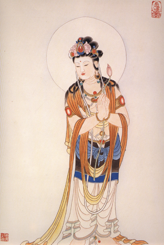

【題解】
論疾，指判斷疾病的部位和性質；診尺，即診察尺膚。本篇介紹了診尺膚的方法及其在診斷上的重要意義，並論述了各種疾病的成因、症狀。故篇名為「論疾診尺」。

【原文】
黃帝問：岐伯曰：余欲無視色持脈，獨調其尺[1]，以言其病，從外知內，為之奈何?
岐伯曰：審其尺之緩急小大滑澀，肉之堅脆，而病形定矣。

【提要】
本段指出了診察尺膚的重要性。

【注釋】
[1]獨調其尺：調，這裏當作診察的意思；尺，就是尺膚，即自腕至肘內側的皮膚。獨調其尺，就是單獨診察尺膚的意思。

【詳解】
黃帝問岐伯說：我想不用通過望色、切脈的方法而單獨依靠診察尺膚，來說明某些疾病的部位和性質，從外在的表現推測內在的變化，臨床上應用哪些具體方法才能做出正確的診斷呢?岐伯說：詳細審察尺膚的緩急、小大、滑澀，肌肉的堅實與脆弱，就可以確定屬於哪一類的病形了。

【原文】
視人之目窠上微癰，如新臥起狀，其頸脈動，時咳，按其手足上，富而不起者，風水膚脹也。尺膚滑其淖澤者，風也。尺肉弱者，解俯，安臥脫肉者，寒熱，不治。尺膚滑而澤脂者，風也。尺膚澀者，風痹也。尺膚粗如枯魚之鱗者，水浹飲也。尺膚熱甚，脈盛躁者，病溫也，其脈盛而滑者，病且出也。尺膚寒，其脈小者，泄、少氣。尺膚炬然先熱後寒者，寒熱也。尺膚先寒，久大之而熱者，亦寒熱也。肘所獨熱者，腰以上熱手所獨熱者，腰以下熱。肘前獨熱者，膺前熱；肘後獨熱者，肩背熱。臂中獨熱者，硬腹熱；肘後粗以下三四寸熱者，腸中有蟲。掌中熱者，腹中熱；掌中寒者，腹中寒。魚上白肉有青血脈者，胃中有寒。尺炬然熱，人迎大者，當奪血。尺堅大，脈小甚，少氣，悅有加，立死。

【提要】
本段論述了診尺膚的方法，並進一步指出，這一方法還必須結合望診、脈診以及肘臂手掌的寒熱情況，才能切中病情。

【詳解】
如果人的眼胞上微微浮腫，好像剛剛睡醒起床的樣子，頸部人迎脈搏動明顯，並且時時咳嗽，再用手指按壓患者的手背和足背部，被按之處凹陷不起，具備了這樣幾個條件，就可以確診為風水膚脹。尺部的皮膚表面滑潤而光澤，是風病。尺部肌肉瘦弱鬆軟，身體倦怠，嗜睡，臥床不起，肌肉消瘦，是寒熱虛勞之病，不容易治癒。尺部肌膚滑潤如膏脂的，是風病。尺部肌膚澀滯不潤的，是風痹。尺部肌膚粗糙不潤，像乾枯的魚鱗，是脾土虛衰、水飲不化的溢飲病。尺部肌膚灼熱，脈盛大而躁動，是溫病。如果脈雖盛大但不躁動而表現滑利的，是病邪將被驅除，正氣漸複，病將痊癒的佳兆。尺部肌膚寒冷不溫，脈細小無力，是泄瀉或氣虛的病證。尺部肌膚高熱灼手，先發熱後發冷的，屬於寒熱往來一類的疾病；尺部肌膚先覺寒冷，但久按之後感覺發熱的，也是寒熱往來一類的疾病。肘部皮膚單獨發熱，標誌著腰以上有熱象手部單獨發熱，標誌著腰以下有熱象。因為肘上應腰上，手部應腰下。肘關節前面發熱，標誌著胸膺部有熱象；肘關節後面發熱，標誌著肩背部有熱象；手臂的中部發熱，標誌著腰腹部有熱象肘部後緣以下三四寸處發熱，標誌著腸道中有寄生蟲存在；掌心發熱，是腹中有熱象的表現；掌心寒冷，是腹中有寒象的表現。手魚際白肉處顯青紫脈絡的，標誌著胃中有寒邪。尺部肌膚高熱炙手，並且頸部人迎脈盛大，屬於熱盛傷陰，營血虧耗的失血證。尺部肌膚急緊，人迎脈細小，則見於氣虛元陽不足。如果加有煩悶現象，並且口趨嚴重，是陰陽俱絕的證候，在短時間內就會死亡。

【原文】
目赤色者病在心，白在肺，青在肝，黃在脾，黑在腎。黃色不可名者，病在胸中。診目痛，赤脈從上下者，太陽病；從下上者陽明病；從外走內者，少陽病。診寒熱，赤脈上下至瞳子，見一脈一歲死；見一脈半一歲半死見二脈二歲死；見二脈半二歲半死；見三脈三歲死。診齲齒痛，按其陽之來，有過者獨熱，在左左熱，在右右熱，在上上熱，在下下熱。診血脈者，多赤多熱，多青多痛，多黑為久痹，多赤、多黑、多青皆見者，寒熱。身痛而色微黃，齒垢黃，爪甲上黃，黃疸也。安臥小便黃赤，脈小而澀者不嗜食。人病，其寸口之脈，與人迎之脈小大等。及其浮沉等者，病難已也。女子手少陰脈動甚者妊子。嬰兒病，其頭毛皆逆上者必死。耳間青脈起者掣痛。大便赤瓣飧泄，脈小者，手足寒，難已；飧泄，脈小，手足溫，泄易也。

【提要】
本段主要講述了觀察眼的顏色及眼中赤脈走行方向來診病的方法。並對診齲齒痛、診絡脈顏色、診黃疽的方法，及孕婦的脈象、嬰兒病易愈與難愈或必死的特徵，作了闡述。

【詳解】
眼睛發紅，說明病在心；見白色，病在肺；見青色，病在肝；見黃色，病在脾；見黑色，病在腎。見黃色而兼有其他顏色，並且難以名狀形容的，說明病在胸中。診察眼睛的疾病，如果有赤色的脈絡從上向下發展的，屬於足太陽經的病；從下向上發展的，屬於足陽明經的病；從目外眥向內走行的，屬於足少陽經的病。有寒熱發作的瘰鬁病時，如果目中有赤脈上下貫瞳子，見一條赤脈的，一年死；見一條半赤脈的，一年半死；見兩條赤脈的，兩年死見兩條半赤脈的，兩年半死；見三條赤脈的，三年死。診察齲齒導致的疼痛，要按壓通過兩側面頰而交叉環繞于口周圍的陽明脈，有經氣太過的部位必然單獨發熱。病在左側的左邊陽明脈熱，在右的右熱，在上的上熱，在下的下熱。診察皮膚上呈現的血脈，赤色愈多，熱象愈重。青色愈多，疼痛愈重。黑色愈多，說明是經久不愈的痹證。如果青色、黑色、赤色多處夾雜相見的，為寒熱相兼的病證。身體困乏隱痛而膚色微黃，牙垢發黃，指甲也呈現黃色，是黃疸病。如果神疲嗜睡，小便黃赤，脈小而又艱澀不滑利，就會有不欲飲食的症狀。人患病以後，在手橈骨部位的寸口脈和頸部的人迎脈搏動力量大小齊等，浮沉現象表現又相一致的，是難以治療的病證。掌後尺骨側凹陷的部位為神門穴，是手少陰心經的動脈所在之處。這條動脈平時細小而隱潛，如果婦女的這條動脈搏動明顯增強，是懷孕的徵象。嬰兒有病時，其頭髮如果蓬亂枯槁，並且向上豎立的，為不治之證。觀察耳廓問細小脈絡，如果出現脈色青黑紫暗，並且有隆起的現象，說明有筋肉抽搐、腹痛的症狀。若大便泄瀉呈青綠色而有乳瓣，是脾胃虛寒完穀不化的飧泄病。再加之脈細小無力，手足冰冷，是脾胃陽氣欲竭，其病也難以治療。假如脈細小，然而手足卻溫暖的，這樣的泄瀉就容易治療。

【按語】
文中關於根據目絡辨癒後內容，說明脈絡少則癒後凶，脈絡多則癒後相對佳，似可從邪氣力量集聚與分散程度來理解。這一內容臨床運用較少，有待進一步研究。

【原文】
四時之變，寒暑之勝，重陰必陽，重陽必陰，故陰主寒，陽主熱，故寒甚則熱，熱甚則寒，故日寒生熱，熱生寒，此陰陽之變也。故日冬傷於寒，春生癉熱春傷于風，夏生後泄腸游夏傷於暑，秋生痃瘧；秋傷於濕，冬生咳嗽。是謂四時之序也。

【提要】
本段論述了四季規律是「重陰必陽，重陽必陰」，並指出四季易發的疾病。

【詳解】
一年四季的氣候變化，暑往寒來，更替變遷。其規律是，陰盛至極則轉變為陽，陽盛至極則轉變為陰。陰主寒，陽主熱，所以寒冷到一定程度就會變熱，熱到極點就會變冷，因此說寒極則生熱，熱極則生寒，這就是天地間陰陽相互消長轉化的道理。所以，冬天感受了寒邪，不即刻發病，隱潛于人體內部形成伏邪，到春天就會形成溫熱病；春天傷於風邪，不即刻發病，到了夏天就會發生飧泄、痢疾之類的疾病；夏天感受了暑邪，不即刻發病，到了秋天就會發生瘧疾；秋天感受了濕邪而潛伏體內，冬天就會發生咳嗽病。這是由於四季氣候不同，依春、夏、秋、冬的時序特點而發生的各種疾病。

【按語】
本段內容，《內經》多處涉及，《素問·陰陽應象大論》、《素問·生氣通天論》亦有類似記載，可參考。

