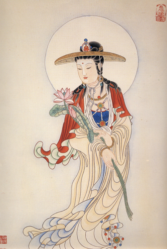

【題解】衛氣行，指衛氣在人體內的運行。文中主要介紹了衛氣在人體內的運行情況。故篇名為「衛氣行」。

【原文】
黃帝問于岐伯曰：願聞衛氣之行，出入之合，何如？
岐伯曰：歲有十二月，日有十二辰，子午為經，卯酉為緯。天周二十八宿，而一面七星，四七二十八星，房昴為緯，虛張為經。是故房至畢為陽，昴至心為陰，陽主晝，陰主夜。故衛氣之行，一日一夜五十周於身，晝日十五周，夜行于陰二十五周，周於五臟。是故平旦陰盡，陽氣出於目，目張則氣上虧於頭，循項下足太陽，循背下至小指之端。其散者，別於目銳眥，下手太陽，下至手小指之間外側。其散者，別於目銳眥，下足少陽，注小指次指之間。以上循手少陽之分，側下至小指之間。別者以上至耳前，合於頷脈，注足陽明，以下行至跗上，入五指之間。其散者從耳下下手陽明，入大指之間，入掌中。其至於足也，入足心，出內踝下，行陰分，複合於目，故為一周。是故日行一舍，人氣行一周與十分身之八日行二舍，人氣行三周於身與十分身之六日行三舍，人氣行于身五周與十分身之四；日行四舍，人氣行于身七周與十分身之二；日虧五舍，人氣行于身九周；日行六舍，人氣行于身十周與十分身之八；日行七舍，人氣行於身十二周在身與十分身之六；日行十四舍，人氣二十五周於身有奇分嘲與十分身之二，陽盡于陰，陰受氣矣。其始入于陰，常從足少陰注於腎，腎注於心，心注於肺，肺注於肝，肝注於脾，脾複注于腎為周。是故夜行一舍，人氣行于陰臟一周與十分臟之八，亦如亍之二十五周，而複合於目。陰陽一日一夜，合有奇分十分身之四，與十分臟之二，是故人之所以臥起之時有早晏者，奇分不盡故也。

【提要】
本段指出了衛氣白天行于陽，夜晚行于陰的具體循行途徑及其具體循行尺度。

【詳解】
黃帝問岐伯說：我想聽你談一談衛氣在人體是如何運行的，什麼時候出於體表，什麼時候進入體內，又是在什麼地方會合的？
岐伯說：一年有十二個月，一天有十二個時辰，子位居正北方，午位居正南方，連接南北的豎線為經，卯位居正東方，酉位居正西方，連接東西的橫線為緯。天體的運行環周於星宿，分佈在東西南北四方，每一方各有七個星宿，四方共計二十八星宿。東方的房宿與西方的昴宿為緯，北方的虛宿與南方的張宿為經。太陽從東方的房宿沿黃道經過南方到4達西方的畢宿，時間是卯、辰、巳、午、未、申六個時辰，這六個時辰是白天，屬陽；太陽從西方的昴宿，沿黃道經過北方到達東方的心宿，時間是酉、戌、亥、子、醜、寅六個時辰，這六個時辰是夜晚，屬陰。一晝夜中，衛氣在體內運行五十個周次，白天行于陽分二十五個周次，夜間行于陰分二十五個周次，並周行於五臟之中。在早晨的時候，衛氣在陰分的循行過程結束，衛氣從目進人陽分，眼睛也就睜開了，然後，衛氣從目內眥上行於頭部，沿項後足太陽膀胱經的通路下行，再沿背部向下行，到足小趾外側端(至陰穴)。其中散行的部分，從目外眥分出來，沿手太陽小腸經下行，至手小指外側端(少澤穴)；另一條散行的部分，也從目外眥分出，沿足少陽膽經下行注入足小趾與第四趾之間(竅陰穴)。衛氣又從上部循手少陽三焦經所過的部位向下行，到手小指與無名指之間(關沖穴)。從手少陽別行的部分，行至耳的前方，會合於頷部的經脈，注入足陽明胃經，向下行至足背，散人足五趾之間(厲兌穴)。還有另一條散行的分支，從耳部下方，沿手陽明大腸經下行，人於手大指和食指之間(商陽穴)，再進人手掌中間。其中運行到足部的衛氣，進入足心，出於內踝，再人足少陰腎經，由足少陰經行于陰分，沿著從足少陰經分出的陰脈向上行，又會合到目，交會於足太陽經的睛明穴。這就是衛氣運行一周的順序。因此，衛氣依照天體晝夜間的運動時間而同步運行。太陽運行一星宿的時間稱為一舍，衛氣在人體循行一周又十分之八。口行二舍，衛氣循行三周又十分之六。日行三舍，衛氣循行五周又十分之四。日行四舍，氣循行七周又十分之二。口行五舍，衛氣循行九周。日行六舍，衛氣循行十周又十分之八。日行七舍，衛氣循行十二周又十分之六。日行十四舍，衛氣循行二十五周及餘數的十分之二。這樣，太陽運行周天的二分之一，由白天進入夜間，衛氣也由陽氣進入陰分。剛剛進入陰分時，由足少陰腎經傳注於腎臟，由腎臟注入心臟，由心臟注入肺臟，由肺臟注入肝臟，由肝臟注入脾臟，由脾臟再傳注到腎臟而成為一周，和白天衛氣行于陽分二十五周一樣，夜間行于陰分也是二十五周。所以，夜間太陽運行一舍的時間，衛氣在陰分也是運行一周又十分之八弱，衛氣在陰分循行二十五周以後，出於目內眥而進入陽分。一晝夜衛氣在人體運行五十周次，可是按照上述每舍衛氣運行一周又十分之八弱計算，太陽運仃二十八舍，衛氣循行共計為五十周又十分之四，這樣就有一個十分之四周的餘數，包括陽分的十分之二周和陰分的十分一周。因此，平時人們略蔔入睡導旦基而釀犧抑出古日古嘛就是這十分之四周的餘數造成的。

【原文】
黃帝曰：衛氣之在於身也，上下往來不以期，候氣而刺之奈何？伯高曰：分有多少[1]日有長短，春秋冬夏，各有分理[2]，然後常以平旦為紀，以夜盡為始。是故一日一．夜，水下百刻，二十五刻者，半日之度也，常如是毋已，日入而止，隨日之長短，各以為紀而刺之。謹候其時，病可與期，失時反候[3]者，百病不治。故日刺實者，刺其來也刺虛者，刺其去也。此言氣存亡之時，以候虛實而刺之。是故謹候氣之所在而刺之，是謂逢時。在於必候其氣在於陽而刺之病在於三陰，必候其氣在陰分而刺之。

【提要】本段指出了針刺候氣的標準，並指出了候氣對針刺治療的重要意義，同時詳細地闡述了具體的針刺方法。

【注釋】
[1]分有多少：因為白天和夜晚的長短隨著季節的改變而改變，所以白天的陽和夜晚的陰並不是平分的，經常是各有多少不同，故稱分有多少。
[2]各有分理：指春夏秋冬四季的晝夜陰陽之分各有一定的規律。
[3]失時反候：失時，指沒有掌握住氣機運行的時機；反候，指沒有候氣，與氣機運行規律不相合。

【詳解】
黃帝說：衛氣在人體的運行，上下循行往返的時間不固定，如何選擇時機而進行針刺呢？
伯高說：根據太陽運行的位置不同，晝夜也有長短的差異，春夏秋冬各個不同的節氣，晝夜長短都有一定的規律。對此可以根據日出時間為基準，此時標誌著夜盡晝始，為衛氣行于陽分的開端。以銅壺滴漏來計時，一晝夜水下一百刻。所以二十五刻恰是半個白天的度數。衛氣就隨著時間的推移而環周不止。到了日沒時，標誌著白天結束。這樣，根據出沒來確定晝與夜，再根據晝夜長短來判斷衛氣的運行出入情況，來作為針刺候氣的標準。針刺時，要等到氣至時再下針，才能得到預期的效果。如果失去時機，違反了候氣的原則而胡亂用針，則任何疾病也不能治癒。候氣而刺的方法，對於實證，應當在氣到來的時候針刺，屬於瀉法；對於虛證，應當在氣運行過去之後針刺，屬於補法。這就是說在氣行盛衰之時，診察虛實而進行針刺。所以說，細心謹慎地審察氣的運行部位而進行針刺，就叫做把握住了時機。病在三陽經，必候氣在陽分時進行針刺；病在三陰經，必候氣在陰分時進行針刺。

【按語】
「候氣而刺之」是《內經》「因時制宜」思想的具體體現，具有重要的指導意義。

【原文】
水下一刻，人氣在太陽；水下二刻，人氣在少陽；水下三刻，人氣在陽明；水下四刻，人氣在陰分。水下五刻，人氣在太陽水下六刻，人氣在少陽；水下七刻，人氣在陽明水下八刻，人氣在陰分。水下九刻，人氣在太陽水下十刻，人氣在少陽；水下十一刻，人氣在陽明；水下十二刻，人氣在陰分。水下十三刻，入氣在太陽；水下十四刻，人氣在少陽；水下十五刻，人氣在陽明；水下十六刻，人氣在陰分。水下十七刻，人氣在太陽；水下十八刻，人氣在少陽水下十九刻，人氣在陽明水下二十刻，人氣在陰分。水下二十一刻，人氣在太陽水下二十二刻，人氣在少陽；水下二十三刻，人氣在陽明水下二十四刻，人氣在陰分。水下二十五刻，人氣在太陽，此半日之度也。從房至畢一十四舍，水下五十刻，日行半度，回行一舍，水下三刻與七分刻之四[1]。大要日常以日之加於宿上也，人氣在太陽。是故日{予一舍，人氣行三陽行與陰分，常如是無已，天與地同紀，紛紛盼盼[2]，終而複始，一日一夜，水下百刻而盡矣。

【提要】
本段指出了衛氣白天在陽經的具體循行情況，並說明了時刻和天上二十八星宿部位的換算關係。

【詳解】
刺時，要等到氣至時再下針，才能得到預期的效果。如果失去時機，違反了候氣的原則而胡亂用針，則任何疾病也不能治癒。候氣而刺的方法，對於實證，應當在氣到來的時候針刺，屬於瀉法；對於虛證，應當在氣運行過去之後針刺，屬於補法。這就是說在氣行盛衰之時，診察虛實而進行針刺。所以二刻，衛氣行於足少衽暗經；球膏鬥三薊，釅葡宇學箏躉萊蒴經；水下十四刻，衛氣行于手足少陽經；水下十五刻，衛氣行于手足陽明經；水下十六刻，衛氣行于足少陰腎經；水下十七刻，衛氣行於手足太陽經；水下十八刻，衛氣行于手足少陽經；水下十九刻，衛氣行于手足陽明經；水下二十刻，衛氣行于足少陰腎經；水下二十一刻，衛氣行於手足太陽經；水下二十二刻，衛氣行于手足少陽經；水下二十三刻，衛氣行于手足陽明經；水下二十四刻，衛氣行于足少陰腎經；水下二十五刻，衛氣行於手足太陽經。這是半個白日中衛氣運行的度數。從房宿到畢宿運轉十四舍，經過整個白天，水下五十刻，太陽運行半個周天；從昴宿到心宿，也是運轉十四舍，經過整個黑夜，水下五十刻，又運轉半個周天。一晝夜合計水下一百刻，太陽運轉二十八舍，整整一個周天。太陽每運行一星宿，水下三又七分之四刻。大略說來，通常是太陽每運行到上一星宿剛過，下一宿開始的時候，衛氣恰恰運行在手足太陽經，而每當。

【注釋】
[1]回行一舍，水下三刻與七分刻之四：因為從星宿角度上說，一天等於二十八舍。而從刻度上說，一天等於一百刻。若將星宿所表現的時刻與刻度所表現的時刻互相換算。
[2]紛紛盼：盼紛，紛繁；盼，ba，音巴，整齊。紛紛盼盼，形容繁多而不雜亂。

【詳解】
從平旦開始，水下一刻的時間，衛氣行於手足太陽經；水下二刻，衛氣行于手足少陽經；水下三刻，衛氣行于手足陽明經；水下四刻，衛氣行于足少陰腎經；水下五刻，衛氣又出陽分行於手足太陽經；水下六刻，衛氣行于手足少陽經；水下七刻，衛氣行于手足陽明經；水下八刻，衛氣行于足少陰腎經；水下九刻，衛氣行於手足太陽經；水下十刻，衛氣行于手足少陽經；水下十一刻，衛氣行于手足陽明經；水下十二刻，衛氣行于足少陽腎經；水下十三刻，衛氣行於手足太陽經；水下十四刻，衛氣行于手足少陽經；水下十五刻，衛氣行于手足陽明經；水下十六刻，衛氣行于足少陰腎經；水下十七刻，衛氣行於手足太陽經；水下十八刻，衛氣行于手足少陽經；水下十九刻，衛氣行于手足陽明經；水下二十刻，衛氣行于足少陰腎經；水下二十一刻，衛氣行於手足太陽經；水下二十二刻，衛氣行于手足少陽經；水下二十三刻，衛氣行于手足陽明經；水下二十四刻，衛氣行于足少陰腎經；水下二十五刻，衛氣行於手足太陽經。這是半個白日中衛氣運行的度數。從房宿到畢宿運轉十四舍，經過整個白天，水下五十刻，太陽運行半個周天；從昴宿到心宿，也是運轉十四舍，經過整個黑夜，水下五十刻，又運轉半個周天。一晝夜合計水下一百刻，太陽運轉二十八舍，整整一個周天。太陽每運行一星宿，水下三又七分之四刻。大略說來，通常是太陽每運行到上一星宿剛過，下一宿開始的時候，衛氣恰恰運行在手足太陽經，而每當轉完一星宿的時間，衛氣也循行完了三陽與陰分，再值太陽運行到下一星宿之上時，衛氣又恰行於手足太陽經，這樣周行不已，隨著自然天體的運行節律而同步運動。衛氣在人體內的運行雖然紛繁，但卻是有條不紊，一周接著一周，終而複始。一晝夜水下一百刻的時間，衛氣恰好在體內運行完畢五十周次。

