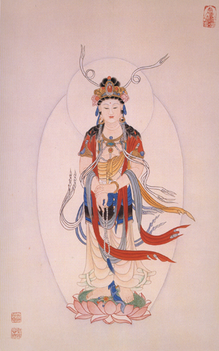

【題解】
九宮，指四方、四隅、中央九個方位；八風，指八方之風。本篇根據九宮的方位，討論了八方氣候變化的情況及對人體的影響，並提出回避風邪預防疾病的重要性，故篇名為「九宮八風」。

【原文】
太一常以冬至之日，居葉蟄之宮四十六日，明日居天留四十六日，明日居倉門四十六日，明日居陰洛四十五日，明日居天宮四十六日，明日居玄委四十六日，明日居倉果四十六日，明日居新洛四十五日，明日複居葉蟄之宮，日冬至矣。太一日遊，以冬至之日，居葉蟄之宮，數所在，日從一處，至九日，複返于一，常如是無已，終而複始。

【提要】本段主要講太一移居九宮的順序以及相應的日期。

【詳解】
北極星位於天極的正中，成為測定方位的中心座標，北斗星圍繞它旋轉，是標定方向位置的指針，一年之內由東向西依次移行。在冬至這一天，斗柄指向正北方的葉蟄宮，並在這個區域運行四十六天，歷經冬至、小寒、大寒三個節氣；期滿後的下一天，時交立春節，就開始移居東北方的天留宮，在這區間運行四十六天，歷經立春、雨水、驚蟄三個節氣；期滿後的下一天，時交春分節，開始移居正東方的倉門宮，在這個區間運行四十六天，歷經春分、清明、穀雨三個節氣；期滿後的下一天，時交立夏，移居東南方的陰洛官，在這個區間運行四十五天，歷經立夏、小滿、芒種三個節氣；期滿後的下一天，時交夏至節，開始移居正南方的上天宮，在此區間運行四十六天，歷經夏至、小暑、大暑三個節氣；期滿後的下一天，時交立秋節，開始移居西南方的玄委宮，在此區間運行四十六天，歷經立秋、處暑、白露三個節氣；期滿後的下一天，時交秋分節，開始移居正西方的倉果宮，在此區間運行四十六天，歷經秋分、寒露、霜降三個節氣；期滿後的下一天，時交立冬節，開始移居西北方的新洛宮，在此區間運行四十五天，歷經立冬、小雪、大雪三個節氣。期滿後的下一天，北斗重新游回葉蟄宮，就又到了冬至日，歷經三百六十六日(閏)回歸年週期，這就是所謂的「太一游宮」。

太一日複一口地遊歷九宮的規律，是以冬至這一天，鬥綱十一月建子，臨於正北方的葉蟄宮，在八卦中屬於一數的坎位，這時陰氣已極，天陽萌生，以此作為起點，來推算其逐日所在之處，其規律是從開始必屬於一數的坎位出發，在各個方位依次遊行了九天，最後仍回復到屬於一數的坎位。經常像這樣迴圈不休，終而複始地輪轉著。

【原文】
太一移日，天必應之以風雨，以其日風雨則吉，歲美民安少病矣，先之則多雨，後之則多汗[1]。太一在冬至之日有變，占在君太一在春分之日有變，占在相；太一在中宮之日有變，占在吏；太一在秋分之日有變，占在將；太一在夏至之日有變，占在百姓。所謂有變者，太一居五宮之日，病風折樹木，揚沙石。各以其所主占貴賤[2]。因視風所從來而占之。風從其所居之鄉來為實風[3]，主生，長養萬物。從其沖後來為虛風，傷人者也，主殺主害者。謹候虛風而避之，故聖人日避虛邪之道，如避矢石然，邪弗能害，此之謂也。

【提要】
本段首先論述了太一在交節之時必引起氣候的變化，從交節前後風雨出現的遲早，可推算氣候的順逆以及其對社會的危害；其次指出風有虛實，並告誡人們謹防虛風。

【注釋】
[1]汗：應當作「旱」為是。
[2]貴賤：指上文君、相、吏、將、百姓而言。
[3]風：從其所居之鄉來為實風所居之鄉，是指太一所據之所。在每一季節所出現當令的風雨為實風，如春生東風，夏為南風，主生主長。
[4]從其沖後來為虛風：凡是從節氣所居方位的對方刮來的風叫做虛風，如冬至刮南風，夏至刮北風，主殺。

【詳解】
太一從一宮轉向下一宮的第一天，也就是每逢交節的日子，必有風雨出現，如果當天和風細雨，是吉祥的象徵。因為這樣風調雨順的年景，必然穀物豐收，禽畜興旺，人民安居樂業，很少有疾病的發生。假若風雨出現在交節之前，就預示這一年多風多雨，發生洪澇災害。反之，如果風雨出現在交節之後，就預示著少雨而乾旱。太一臨葉蟄宮，時交冬至營曲二寺魯膀由九咀古盎觸亦，古稀殺饕麗置酌茱湘罔為太一是天元之主宰，居於宸極，南面而治。冬至這一天又是一歲之首，位在正北，所以與君主相應；在交春分節的這一天，氣候有暴變，就預示著國相有災患，因為相位在左，職司教化布政，而春分東臨卯正，春氣陽和，所以與國相相應；．太一在中宮土旺主令的時間，也就是寄居于四隅立春、立夏、立秋、立冬各自交節的那些天，氣候發生突變，預示國中大小官，吏有災變。因為他們分治國中，各司其守，立春、立夏、立秋、立冬分治四隅與普通官吏相應；在交秋分節的這一天，氣候有驟然變化，預示將軍的災患，因為將位在右，職司殺伐，而秋分西臨酉正，秋氣肅殺，所以與將軍相應；在交夏至節的這一天，氣候有劇烈變化，預示百姓們有禍患，因為夏至南臨午正，陽氣升發，庶物蕃盛，與操百業而生的億萬百姓相應。所謂氣候有突然變化，是指太一臨上述五宮的日子，出現折斷樹木，飛沙走石的狂風。這種氣候，根據出現在不同的節氣，其傷害性會反映在不同的階層。因此，也是預測不同身份的人受病的依據。同時還應當察看風向的來路，作為預測氣候正常與否的依據。凡是風來自當令的方位，比如說時值冬至，位臨子方，氣候以陰寒為特點，應當以北風凜冽為順；時交春分，位臨卯方，天氣溫和，應當以東風拂煦為順；時交夏至，位臨午方，天氣炎熱，應當以南風烘熔為順；時交秋分，位臨酉方，天氣清涼，應當以西風蕭肅為順。這樣的正位之風，又叫做實風，主生長，養育萬物，反之，如果風從當令相對的方位而來，出現與季節相抵觸的氣候，叫虛風。它能夠傷人致病，主摧殘，危害萬物。平時應密切注視這種異常氣候，謹慎地加以預防。所以那些對養生之道素有高度修養的人，時刻防避四時不正之氣，免受它的危害，就像躲避箭矢礓石一樣，從而使外邪不能內侵，保證機體健康，就是這個道理。

【原文】
風從南方來，名曰大弱風[1]，其傷人也，內舍於心，外在於脈，氣主熱。風從西南方來，名曰謀風[2]，其傷人也，內舍於脾，外在於肌，其氣主為弱。風從西方來，名曰剛風[3]，其傷人也，內舍於肺，外在於皮膚，其氣主為燥。風從西爿匕方來，名曰折風[4]，其傷人也，內舍於小腸，外在於手太陽脈，脈絕則溢，脈閉則結不通，善暴死。風從北方來，名曰大剛風[5]，其傷人也，內舍於腎，外在於骨與肩背之膂筋，其氣主為寒也。風從東北方來，名曰凶風[6]，其傷人也，內舍於大腸，外在於兩脅腋骨下及肢節。風從東方來，名曰嬰兒風[7]川，其傷人也，內舍於肝，外在於筋紐，其氣主為身濕。風從東南方來，名曰弱風[8]，其傷人也，內舍於胃，外在肌肉，其氣主體重。此八風皆從其虛之鄉來，乃能病人。三虛相搏，則為暴病卒死。兩實一虛，病則為淋露寒熱。犯其兩濕之地，則為痿。故聖人避風，如避矢石焉。其有三虛而偏中於邪風，則為擊僕偏枯矣。

【提要】
本段論述了八方之虛風對人體的傷害情況，簡述了虛人中虛風病情嚴重，並教導人們謹防虛風侵襲人體。

【注釋】
[1]大弱風：南風離火宮，熱盛則風至必微，故稱大弱風。其在人以火臟應之，內應心，外在脈。
[2]謀風：西南方坤土宮之風，陰氣方生，陽氣尤盛，陰陽去就，若有所議，故稱謀風，其在人一土臟應之。
[3]剛風：西方兌金宮之風，金氣剛勁故稱剛風，其在人以金臟應之。
[4]折風：西北方乾金宮之風，金主折傷，故稱折風。
[5]大剛風：北方坎水宮之風，氣寒則風烈，故稱大剛風，其在人以水臟應之。
[6]凶風：東北方艮土宮之風，陰氣未退，陽氣未盛，故稱凶風。
[7]嬰兒風：東方震木宮之風，東應春，萬物始生，故稱嬰兒風，其在人以木臟應之。
[8]弱風：東南巽木宮之風，氣暖而風柔，故稱弱風，東南濕盛，濕氣侮土，故其在人內傷於胃腑，外主肌肉身重。

【詳解】
太一位居於天極中央，成為定向的中心座標，根據鬥星旋轉的指向，以中宮巡臨八宮，從而定八風的方位，來推測氣候的正常與異常。從南方來的風，名叫大弱風，它傷害到人體，內可侵入於心，外在於血脈，因屬於南方火熱之邪，所以其氣主熱證。從西南方來的風，名叫謀風，它傷害到人體，內可侵入於脾，外則在於肌肉。脾為後天之本，所以其氣主虛性病證。從西方來的風，名叫剛風，它傷害到人體，內可侵入於肺，外則留於皮膚之間，由於西方屬金，風性剛烈，所以其氣主燥性病證。從西北方來的風，名叫折風，它傷害到人體，內可侵入小腸，外在於手太陽經脈。如果脈氣竭絕，說明疾病惡化而深陷擴散；如果其脈氣閉塞，氣機聚結不通，往往會形成猝然死亡。從北方來的風，名叫大剛風，它傷害到人體，內可侵入於腎，外在於骨骼和肩背的膂筋部；因為北風陰寒至盛，遏傷腎陽，所以其氣主寒性病證。從東北方來的風，名叫凶風，它傷害到人體，內可侵人大腸，外在於兩脅腋骨下及肢體關節。從東方來的風，名叫嬰兒風，它傷害到人體，內可侵入於肝，外在於筋的連結之處。因為東方為水鄉濕地，東風多雨，所以其氣主濕性病證。從東南方來的風，名叫弱風，它傷害到人體，內可侵人於胃，外在於肌肉。因為東南濕盛，其氣重濁，所以其氣主身體困重不揚之病證。上面所說的八種風，凡是從當令節氣相對的方向而來的，都屬於虛風賊邪，因為是違背時令的不正之氣，所以它能使人發生疾病。人與自然息息相通，如果人體虛弱，時值這一年的氣運衰微，恰逢月廓虧空，又失卻時宜之和，這樣三虛相結合，內外相因，正不勝邪，就會得暴病，猝然死亡。如果三虛之中只犯一虛，也能發生疲勞困倦，寒熱相兼的病證。如果冒雨或涉水，或久居潮濕之地，感受濕邪，傷於肌肉，便會發生痿病。所以，深知養生之道的人，預防賊風邪氣，如同躲避弓箭和礓石的射擊一樣。不然的話，如果恰逢三虛相遇，就有可能偏中於邪風，而導致突然昏厥僕倒，或引起半身不遂一類的病證。

 

