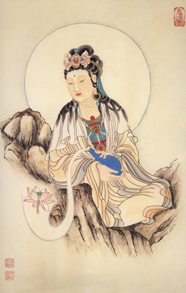

【題解】
惑，迷亂眩暈的意思；大，形容其嚴重。文中主要論述了登高時發生精神迷惑、頭目眩暈的道理，故篇名為「大惑論」。

【原文】
黃帝問于岐伯曰：余嘗上於清冷之台，中階而顧，匍匐而前則惑。餘私異之，竊內怪之，獨瞑獨視，安心定氣，久而不解。獨博[1]獨眩，披發長跪，俯而視之，後久之不已也。卒然自上，何氣使然？
岐伯對曰：五臟六腑之精氣，皆上注於目而為之精。精之窠為眼，骨之精為瞳子，筋之精為黑眼，血之精為絡，其窠氣之精為白眼，肌肉之精為約束，裹擷[2]筋骨血氣之精而與脈並為系，上屬於腦，後出於項中。故邪中于項，因逢其身之虛，其入深，則隨眼系以入於腦，入於腦則腦轉，腦轉則引目系急，目系急則目眩以轉矣。邪其精[3]，其精所中不相比也則精散，精散則視歧，視歧見兩物。目者，五臟六腑之精也，營衛魂魄之所常營也，神氣之乒廳生也。故神勞則魂魄散，志意亂。是故瞳子黑眼法于陰，白眼赤脈法于陽也，故陰陽合傳[4]而精明也。目者，心使也，心者，神之舍也，故神精亂而不轉，卒然見非常處，精神魂魄，散不相得，故日惑也。

黃帝曰：餘疑其然。余每之東苑[5]，未曾不惑，去之則複，餘唯獨為東苑勞神乎？何其異也？
岐伯曰：不然也。心有所喜，神有所惡，卒然相惑[6]，則精氣亂，視誤故惑，神移乃複。是故間者為迷，甚者為惑。

【提要】
本段論述了人的眼睛是由五臟之精氣所充養，眼睛的各部分分屬於五臟，眼睛由目系連屬於腦的理論。

【注釋】
[1]博：當作「轉」，即頭暈的意思。
[2]擷：包裹的意思。
[3]邪其精：「邪」後當有「中」字。
[4]傳：通搏，搏聚的意思。
[5]東苑：養禽獸，植林木之處叫「苑」。東苑，指清冷之台在東苑。
[6]惑：作「感」為是。

【詳解】
黃帝說：我曾經攀登那高高的清冷之台，上到臺階中層時，向四處觀望，然後伏身前行，就感到頭眩眼花，精神迷亂。這種異常的感覺，我暗自感到奇怪，儘管自己閉目寧神或睜眼再看，平心靜氣，力圖使精神鎮定下來，但是這種感覺長久不能消除，仍然感到頭暈目眩。即使是披散開頭髮，赤腳而跪在臺階上，力求形體舒緩，使精神輕鬆，但當向下俯視時，眩暈仍長久不止，有時這種症狀在突然之間卻又能自行消失，這是什麼原因造成的呢？
岐伯回答說：五臟六腑的精氣，都向上輸注於人的眼部，從而產生精明視物的作用。臟腑精氣彙聚於眼窩，便形成眼睛。其中腎的精氣充養瞳子，肝的精氣充養黑睛，心的精氣充養內外眥的血絡，肺的精氣充養白睛，脾的精氣充養眼胞。脾的精氣包裹著肝、腎心、肺的精氣，與脈絡合併，形成目系，向上連屬於腦部，向後與項部中間相聯繫。如果邪氣侵入項部，乘人體虛弱而向深部發展，則沿著目系而侵入於腦部。邪人於腦，便發生頭暈腦轉，從而引起目系拘急而出現兩目眩暈的症狀。如果邪氣損傷眼部的精氣，使精氣離散，就會出現視歧的現象，即看一件東西好像有兩件一樣。人的眼睛，既是臟腑的精氣所形成，也是營、衛、氣、血、精、神、魂、魄通行和寓藏的所在。其精明視物的功能，是以神氣為基礎的。所以人在精神過度疲勞的時候，就會出現魂魄失守，意志散亂，眼睛迷離而無神氣。眼的瞳子部分屬於腎，黑睛屬於肝，二者為陰臟的精氣所滋養；白睛屬肺，眼球的赤脈屬於心，二者依賴陽臟的精氣所滋養。因此，陰臟的精氣和陽臟的精氣相互結合而協調，才能使眼睛具有視物清晰的功能。眼睛的視覺功能，主要受心的支配，這是因為心主藏神的緣故。如果精神散亂，陰臟的精氣和陽臟的精氣不能相互協調，突然看到異常的景物，就會引起心神不安，精失神迷，魂飄魄散，所以發生迷惑眩暈。

黃帝說：我有些懷疑你所說的道理。我每次去東苑登高遊覽，沒有一次不發生眩暈迷惑的，離開那裏，就恢復正常，難道說我惟獨在東苑那個地方才會勞神嗎？那為什麼會出現這種異常的情況呢？
岐伯說：不是這樣。就人的心情而言，都有自己喜好的東西和厭惡的東西，愛憎兩種情緒突然相感，會使精神出現一時的散亂，所以視覺不正常而發生眩暈迷惑。等到離開了當時的環境，精神也就轉移，就會恢復正常狀態。總之，出現這種症狀，較輕的僅是精神一時迷糊，好像不能辨別方向似的，較重的就會出現精神迷亂而頭目眩暈。

【按語】
本段論述了眼睛與五臟在生理上的密切聯繫。指出了眼睛的所有組成部分都是分屬於五臟的。瞳子屬腎，黑睛屬肝，血絡屬心，白眼屬肺，上下瞼屬脾。這一理論為後世眼科的「五輪學說」奠定了基礎。

【原文】
黃帝曰：人之善忘者，何氣使然？
岐伯曰：上氣不足，下氣有餘，腸胃實而心肺虛。虛則營衛留於下，久之不以時上，故善忘也。

黃帝曰：人之善饑而不嗜食者，何氣使然？
岐伯曰：精氣並於睥，熱氣留於胃，胃熱則消谷，穀消故善饑。胃氣逆上，則胃脘寒，故不嗜食也。

黃帝曰：病而不得臥者，何氣使然？
岐伯曰：衛氣不得入于陰，常留于陽。留于陽則陽氣滿，陽氣滿則陽趼盛，不得入于陰則陰氣虛，故目不瞑矣。

黃帝曰：病目而不得視者，何氣使然？
岐伯曰：衛氣留于陰，不得行于陽。留于陰則陰氣盛，陰氣盛則陰曰滿，不得入于陽則陽氣虛，故目閉也。

黃帝曰：人之多臥者，何氣使然？
岐伯曰：此人腸胃大而皮膚濕，而分肉不解焉。腸胃大則衛氣留久，皮膚濕則分肉不解，其行遲。夫衛氣者，晝日常行于陽，夜行于陰，故陽氣盡則臥，陰氣盡則寤。故腸胃大，則衛氣行留久；皮膚濕，分肉不解，則行遲。留于陰也久，其氣不清，則欲瞑，故多臥矣。其腸胃小，皮膚滑以緩，分肉解利，衛氣之留于陽也久，故少瞑焉。

黃帝曰：其非常經也，卒然多臥者，何氣使然？
岐伯曰：邪氣留於上瞧，上瞧閉而不通，已食若飲湯，衛氣留久于陰而不行，故卒然多臥焉。

【提要】
本節分別論述了善忘、善饑而不嗜食、不得臥、不得視、多臥、少瞑、卒然多臥七個病證的病機。

【詳解】
黃帝說：人出現健忘，是什麼原因引起的呢？
岐伯說：這是由於心肺兩臟不足，而使得人體上部氣虛，腸胃充實而使得人體下部氣盛。心肺氣虛就會使得營衛之氣不能及時向上宣達敷布，長時問滯留於腸胃之間，導致神氣失養，所以發生健忘。

黃帝說：人如果容易饑餓，但沒有食慾，是什麼原因造成的呢？
岐伯說：飲食人胃後化生的精氣，輸送於脾。如果邪熱之氣停留於胃，就會使胃熱而消化力增強，所以容易饑餓。熱邪使得胃氣上逆，導致胃脘滯塞，難以受納，所以出現不欲飲食的症狀。

黃帝說：因病而不能入睡，是什麼原因引起的呢？
岐伯說：衛氣在白天行于陽分，人處於清醒狀態，夜間衛氣入于陰分，人就能入睡。如果衛氣不能人于陰分，經常停留在陽分，就會使衛氣在人體的陽分處於盛滿狀態，相應的陽躋脈就偏盛，衛氣不能人于陰分，就形成陰氣虛，陰虛不能斂陽，所以就不能安睡。

黃帝說：因病而兩目閉合不能視物，是什麼原因引起的？
岐伯說：這是因為衛氣滯留于陰分，不能外行于陽分。留滯在陰分使陰氣偏盛，陰躋脈隨之而盛滿，衛氣既然不得行于陽分，便形成陽虛，所以願意閉目而不欲視物。

黃帝說：有的人發生嗜睡，是什麼原因引起的呢？
岐伯說：這一類人的特點是腸胃較大而皮膚滯澀，肌肉之間又不滑利。由於腸胃較大，衛氣在人體內部滯留的時間就比較長；皮膚滯澀，分肉之間不滑利，衛氣在體表的運行因受到阻止而遲緩。衛氣在人體循行的常規是白天行在陽分，夜間行于陰分。當衛氣隨晝夜交替在人體陽分運行已盡，由陽人陰時，人就入睡了；衛氣在人體陰分運行已盡，由陰出陽，人便覺醒。既然這類人的腸胃較大，衛氣在內滯留的時間比較長，再兼皮膚滯澀，分肉組織不滑利，因此衛氣運行於體表就較遲緩，使得精神不能振作，所以困倦而嗜睡。那些腸胃較小、皮膚滑潤弛緩，分肉組織之間又通暢滑利的人，衛氣行于陽分的時間比較長，所以睡眠較少。

黃帝說：有的人不是經常嗜睡，而是突然間出現多臥嗜睡現象，這是什麼原因引起的呢？
岐伯說：這是因為邪氣滯留于上焦，使得上焦氣機閉阻不通，又因飽食之後，暴飲熱湯，衛氣滯留在胃腸中，致使衛氣久留于陰分，而不能外行于陽分，所以出現突然多臥嗜睡的症狀。

【原文】
黃帝曰：善。治此諸邪奈何？
岐伯曰：先其臟群，誅其小過，後調其氣，盛者瀉之，虛者補之，必先明知其形志之苦樂，定乃取之。

【提要】
本段論述了對以上七種病證，先要察明患者的形志苦樂，然後再根據正確的診斷進行治療。

【詳解】
黃帝說：講得很好。對於上述疾病如何進行治療呢？
岐伯說：首先要觀察臟腑的虛實，辨明病變的部位，即使是輕微邪氣，也必須先加以消除，然後再調理營衛之氣。邪氣盛的採用瀉法，正氣虛的採用補法。還要首先審察患者形體的勞逸、情志的苦樂，做出正確診斷，然後才能進行治療。

