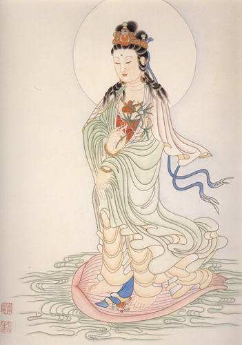

【題解】
癰、疽，是外科疾病中的兩類病證。文中專門論述了癰和疽的成因、表現、治療及癒後等，故篇名為「癰疽」。

【原文】
黃帝曰：余聞腸胃受谷，上焦出氣，以溫分肉，而養骨節，通腠理。中焦出氣如露，上注豁穀，而滲孫脈，津液和調，變化而赤為血，血和則孫脈先滿溢，乃注於絡脈，皆盈，乃注於經脈。陰陽已張，因息乃行叫，行有經紀，周有道理，與天合同，不得休止。切而調之，從虛去實，瀉則不足。疾則氣減，留則先後。從實去虛，補則有餘。血氣已調，形氣乃持。余已知血氣之平與不平，未知癰疽之所從生，成敗之時，死生之期，有遠近，何以度之，可得聞乎？
岐伯曰：經脈留行不止，與天同度，與地合紀。故天宿失度，日月薄蝕，地經失紀，水道流溢，草萱不成引，五穀不殖，徑路不通，民不往來，巷聚邑居，則別離異處，血氣猶然，請言其故。夫血脈營衛，周流不休，上應星宿，下應經數。寒邪客於經絡之中則血泣，血泣則不通，不通則衛氣歸之，不得複反，故癰腫。寒氣化為熱，熱勝則腐肉，肉腐則為膿，膿不瀉則爛筋，筋爛則傷骨，骨傷則髓消，不當骨空，不得泄瀉，血枯空虛，則筋骨肌肉不相榮，經脈敗漏，熏於五臟，臟傷故死矣。

【提要】
本節論述了營衛氣血的運行，並闡明了癰腫的病因、病機。

【詳解】
黃帝說：我聽說腸胃受納飲食物以後，所化生的精氣沿著不同的通道運行於全身。其中出於上焦的衛氣，能夠溫煦全身的肌肉、皮膚，濡養筋骨關節，通達於腠理。出於中焦的營氣，像自然界雨露布灑大地一樣，流注於人體肌肉的大小空隙之間，同時還滲入孫脈，加上津液和調，通過心肺的氣化作用，就化成紅色的血液而運行於人體的脈道之中。血液運行和順而有條不紊，首先充滿孫絡，再注入絡脈，絡脈充滿了便注入經脈，這樣陰經陽經的血氣充盛，便隨著呼吸而運行於全身。營衛的運行有一定的規律和迴圈道路，與天體的運行一樣，周而復始，無休無止。如果發生病變，要細心地診察虛實，然後進行調治。用瀉法去治療實證，就能使邪氣衰減，但瀉得太過，反會損傷正氣。瀉法宜急速出針，可迫使邪氣衰減，若僅用留針法，不能及時瀉邪，則病情先後如一，仍不見好轉。相反，用扶正的方法，可以消除虛弱的現象，但過於補了，也會助長邪之勢。經過調治，氣血就會協調，形體和神氣也就可以保持正常的生理活動了。關於血氣是否平衡的道理，我已經知道了。但還不瞭解癰疽發生的原因和機理，又怎樣把握其形成與惡化的時間及判斷死生口期的遠近呢？你可以講給我聽一聽嗎？
岐伯說：氣血運行於經脈，迴圈不止，它與天地的運動規律相一致。如果天體運轉失其常度，就會出現日蝕月蝕；大地上江河淤塞或決潰，就氾濫四溢，水澇成災，以致草木不長，五穀不生，道路不通而民眾不能往來，使得長年居住在城裏或鄉間的百姓們流離失所。人體的氣血也是這樣，請讓我談談其中的道理。人體的血脈營衛周流不息，與天上星宿的運轉、地面河水的流行相應。如果寒邪侵入經脈血絡之中，就會使得血行滯澀，血行滯澀不通，衛氣也就壅積不散，氣血不能往復周流而聚結在某一局部，便形成癰腫。寒氣鬱久化熱，熱毒盛積薰蒸，使肌肉腐爛，肌肉腐爛便化成膿液，膿液不得排出，又會使筋膜腐爛，進而傷及骨骼，骨髓也就隨之消損了。如果癰腫不在骨節空隙之處，熱毒就不能向外排泄，煎熬血液而令其枯竭，使筋骨肌肉都得不到營養，經脈破潰敗腐，於是熱毒深入灼傷五臟。由於五臟損傷，人就會死亡。

【原文】
黃帝曰：願盡聞癰疽之形，與忌日名。
岐伯曰：癰發於嗌中，名曰猛疽，猛疽不治，化為膿，膿不瀉，塞咽，半日死；其化為膿者，瀉則合豕膏，冷食，三日而已。發於頸，名曰天疽，其癰大以赤黑，不急治，則熱氣下入淵腋，前傷任脈，內熏肝肺，熏肝肺十餘日而死矣。

陽留大發，消腦留項，名曰腦爍州，其色不樂，項痛而如刺以針，煩心者死不可治。

發於肩及牖，名曰疵癰，其狀赤黑，急治之，此令人汗出至足，不害五臟，癰發四五日逞炳之引。

發於腋下赤堅者，名曰米疽，治之以砭石，欲細而長，蹤砭之，塗以豕膏，六日已，勿裹之。其癰堅而不潰者，為馬刀挾癭，急治之。

發于胸，名曰井疽，其狀如大豆，三四日起，不早治，下入腹，不治，七日死矣。

發于膺，名曰甘疽，色青，其狀如穀實菰蕕吲，常苦寒熱，急治之，去其寒熱，十歲死，死後出膿。

發於脅，名曰敗疵，敗疵者女子之病也，灸之，其病大癰膿，治之，其中乃有生肉，大如赤小豆，判陵蔻。草根各一升，以水一鬥六升煮之，竭為取三升，則強飲厚衣，坐於釜上，令汗出至足已。

發於股脛，名曰股脛疽，其狀不甚變，而癰膿搏骨，禾急治，三十日死矣。

發於尻，名曰銳疽，其狀赤堅大，急治之，不治，三十日死矣。

發于股陰，名曰赤施，不急治，六十日死，在兩股之內，不治，十日而當死。

發於膝，名曰疵癰，其狀大癰，色不變，寒熱，如堅石，勿石，石之者死，須其柔，乃石之者生。

諸癰疽之發於節而相應者，不可治也。發于陽者，百日死；發于陰者，三十日死。

發於脛，名曰兔齧，其狀赤至骨，急治之，不治害人也。

發於內踝，名曰走緩，其狀癰也，色不變，數石其輸引，而止其寒熱，不死。

發於足上下，名曰四淫，其狀大癰，急治之，百日死。發於足傍，名曰厲癰，其狀不大，初如小指發，急治之，去其黑者，不消鯫益，不治，百日死。

發於足指，名脫癰，其狀赤黑，死不治；不赤黑，不死。不衰，急斬之，不則死矣。

【提要】
本段分別論述了猛疽、天疽、腦爍等十九中癰疽的病名、症狀、部位以及治療與癒後。

【詳解】
黃帝說：我想詳盡地瞭解癰疽的形狀、死生的限和名稱。
岐伯說：癰疽發生在喉結的叫做猛疽。這種病如不及時治療就要化膿，若不將膿液排出，就會使咽喉堵塞，半天就會死亡。已經化膿的，要先刺破排膿，再口含涼的豬油，三天即可痊癒。

發生在頸部的，叫做天疽。這種癰部位較大，顏色呈赤黑色，如果不迅速治療，熱毒就會向下蔓延，侵入腋下的淵腋穴處，向前面可傷及任脈，向內可熏灼肝肺，使肝肺損傷，十幾天就會死亡。

邪熱亢盛，滯留于項部，上侵而消爍腦髓的，叫做腦爍。表現為神色抑鬱不歡，頸部劇痛如針刺，如熱毒內攻而出現心中煩躁，是不治的死證。發生在肩臂部的癰腫，叫做疵癰，局部呈赤黑色，應當迅速治療，此證使人遍身汗出，直到足部，由於引起此癰的毒氣浮淺而不深陷，不會傷及五臟，即使在發病四五天的時候速用艾灸治療，也會很快痊癒。

癰腫發生在腋下，局部堅硬而呈深紅色的，叫做米疽。應當用細而長的石針稀疏地砭刺患處，然後塗上豬油膏，不必包紮，大約六天就能痊癒。如果癰腫堅硬而沒有破潰的，稱為馬刀挾癭之類的病變，應當急速採取相應措施進行治療。

生在胸部的癰腫，叫做井疽。它的形狀像大豆一樣，在初起的三四天內如果不及早治療，毒邪就會下陷而深入腹部，成為不治之證，七天就會死亡。

生在胸部兩側的，叫做甘疽。局部呈青色，形狀好像楮實和瓜蔞的樣子，時常發冷發熱，應急速治療以解除寒熱。如果不及時治療，可遷延十年之久而死亡，死後潰破出膿。

脅肋部生癰，名叫敗疵，敗疵主要發生于婦女。如果遷延日久，就會發展為大的膿腫，其中還生有赤小豆大小的肉芽。治療這種病候，可用切割的連翹草根各一升，加水一鬥六升，煎取三升，乘熱強飲，並多穿衣服，坐在盛有熱湯的鐵鍋上薰蒸，使病人汗出至足部，即可痊癒。

癰疽生在大腿和足脛部的，名叫股脛疽。這種病的外部沒有明顯的變化，然而癰腫所化的膿緊貼骨上，如果不迅速治療，約三十日即可死亡。

癰疽生在尾骶骨部的，名叫銳疽。其形狀紅、大而堅硬，應當迅速治療，否則，約三十天就會死亡。癰疽發生在大腿內側的，名叫赤施。如不迅速治療，至六十天就會死亡。如果兩腿內側同時發病，是毒邪傷陰已極，多屬不治之證，十天就要死亡。

發生在膝部的，名叫疵疽。其症狀是外形腫大，皮膚顏色沒有變化，伴有發冷發熱，患處堅硬，這是尚未成膿的表現，切不可用砭石刺破，如果誤用砭石刺破排膿，便會導致死亡。須待患處柔軟成膿，再用砭石刺破，以排膿瀉毒，疾病就會痊癒。

發生在關節的各種癰疽，並且出現內外、上下、左右對稱發病的，都不易救治。生於陽經所在部位的，約一百天死；生於陰經所在部位的，約三十天死。

發生於足脛部的，名叫兔齧疽，其外形紅腫，毒邪能夠深入至骨，應當迅速治療，如不急治，就會危害生命。

癰毒發於內踝的，名叫走緩。其外形如癰，但皮膚顏色沒有變化。治療時應當用石針屢屢砭刺癰腫所在之處，使寒熱的症狀消退，就不會死亡。

癰疽發生於足心、足背的，名叫四淫。其形狀好像大癰一樣，如不迅速治療，約一百天就會死亡。

癰腫生在足四傍的，名叫厲疽。其外形不大，如果從足小趾開始發病，並呈現黑色，應當迅速治療以消除黑色，如果黑色不消退，卻逐漸加重，就不能治癒了，約一百天就會死亡。發生在足趾的，名叫脫疽，其症狀如果出現赤黑色，是毒氣極重，多屬不治的死證；如不呈現赤黑色，是毒氣較輕，尚能救治。如經過治療而病勢仍不減輕，應當迅速截除其足趾，否則毒氣內攻深陷于臟腑，必然導致死亡。

【原文】
黃帝曰：夫子言癰疽，何以別之？
岐伯曰：營衛稽留於經脈之中，則血泣而不行，不行則衛氣從之而不通，壅遏而不得行，故熱。大熱不止，熱勝則肉腐，肉腐則歲膿。然不能陷，骨髓不為煉枯，五臟不為傷，故命日癰。

黃帝曰：何謂疽？
岐伯曰：熱氣淳盛，下陷肌膚，筋髓枯，內連五臟，血氣竭，當其癰下，筋骨良肉皆無餘，故命日疽。疽者，上之皮夭以堅，上如牛領之皮。癰者，其皮上薄以澤。此其候也。

【提要】
本段主要論述了癰和疽的區別。

【詳解】
黃帝說：你所談的癰疽應當如何鑒別呢？
岐伯說：如果營氣滯留在經脈中，血液就凝聚而不能暢行，從而使衛氣受到影響也阻滯不通，使壅積於內而化生毒熱。如毒熱發展不止，便使肌肉腐爛化膿。但是這種毒熱僅僅浮淺在體表，不能深陷到骨髓，所以骨髓不會被灼傷而焦枯，五臟也不會受其傷害，這種疾病就叫做癰。

黃帝說：什麼叫做疽呢？
岐伯說：如果熱毒亢盛，深陷於肌膚的內部，使筋膜潰爛，骨髓焦枯，同時還影響五臟，使血氣枯竭。其發病部位比癰的發病部位深，使得筋骨肌肉等都潰爛無遺，所以稱之為疽。疽的特徵是皮色晦暗而堅硬，如同牛頸部的皮一樣，癰的特徵，是皮薄而光亮。這些就是癰和疽的區別。

